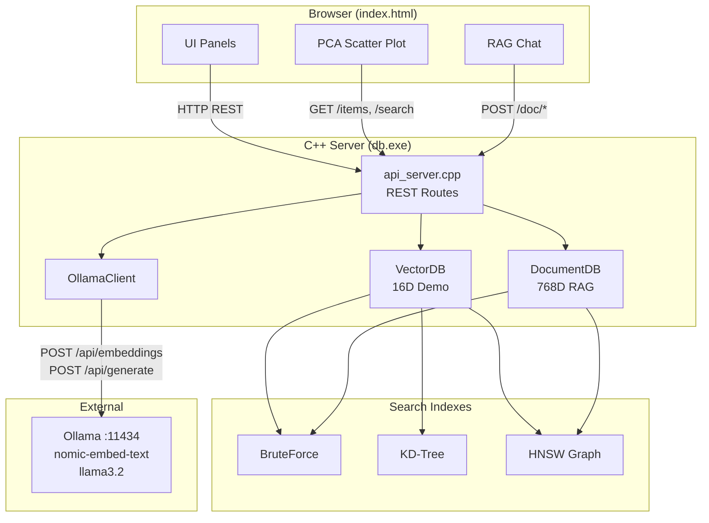
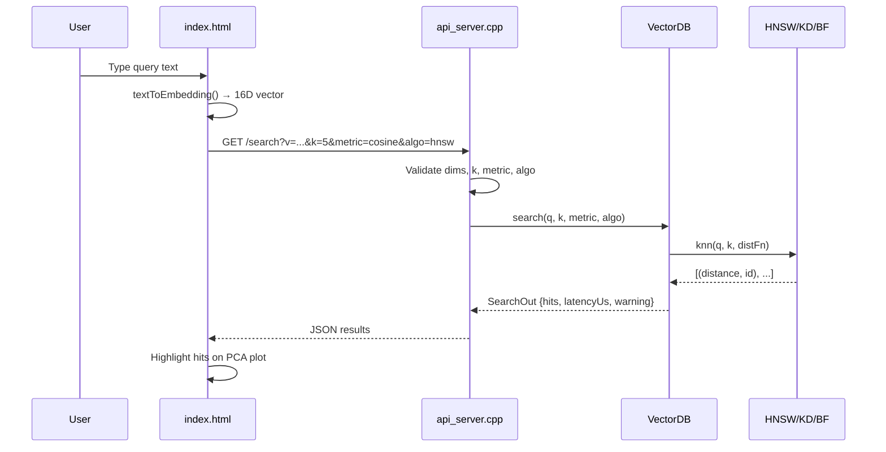
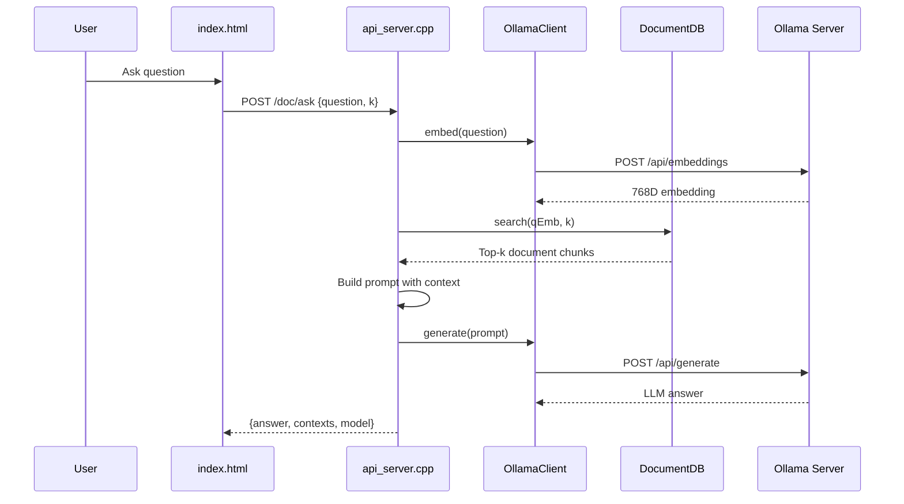
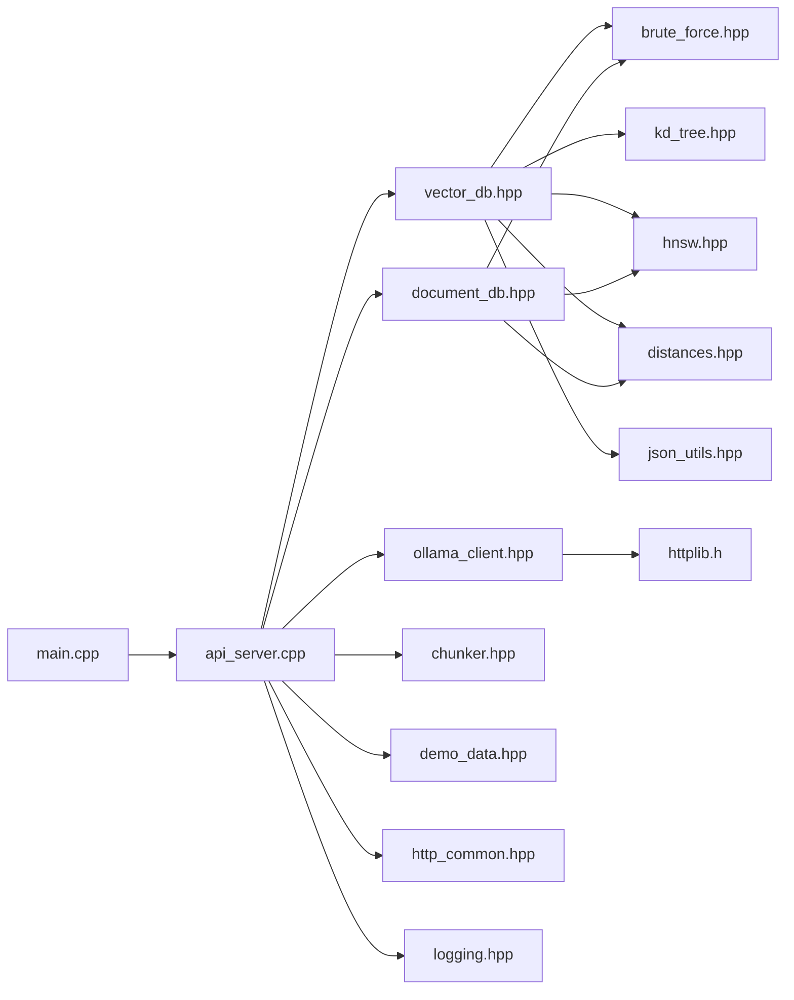
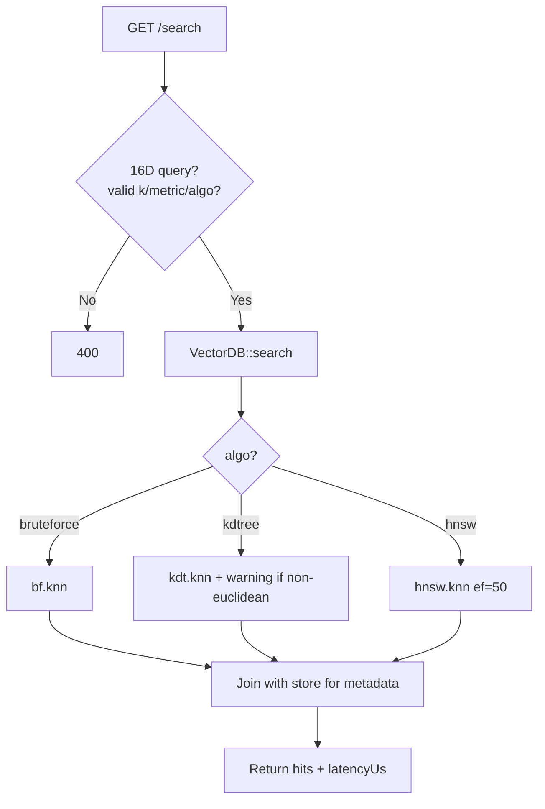
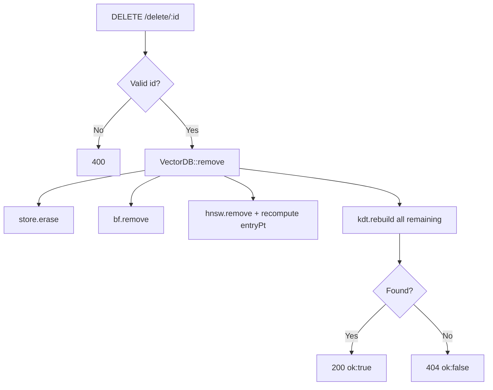
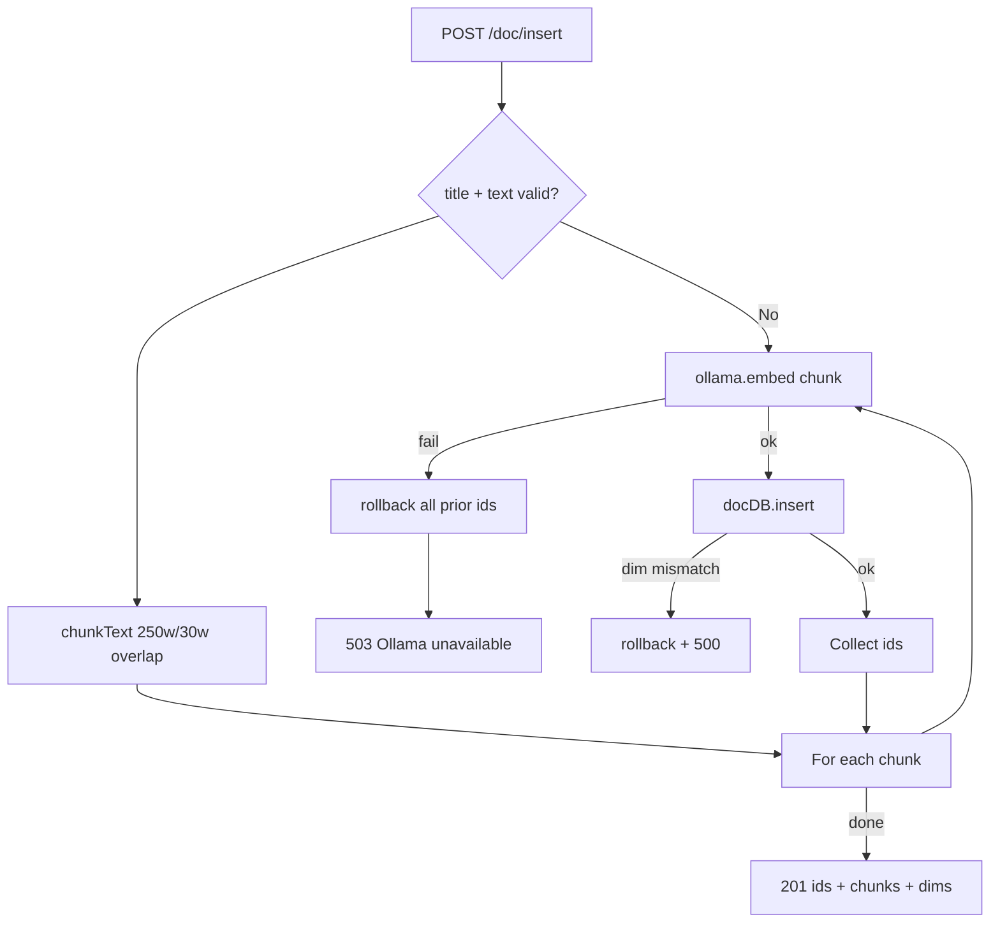
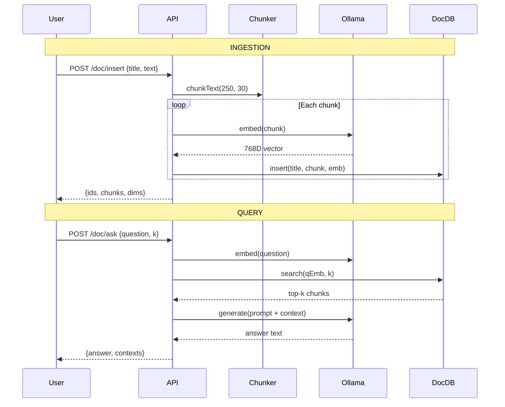

# MY-AI — Project Master Documentation

**Author:** Pratham Raj, NIT Patna  
**Project:** C++ Vector Database + RAG with HNSW, KD-Tree, Brute Force, Ollama, REST API, PCA Frontend  
**Stack:** C++17 · cpp-httplib · Ollama (`nomic-embed-text`, `llama3.2`)  
**License:** MIT — Copyright (c) 2026 Pratham Raj, NIT Patna

---

## Table of Contents

1. [Executive Summary](#1-executive-summary)
2. [System Architecture](#2-system-architecture)
3. [Search Algorithms](#3-search-algorithms)
4. [Distance Metrics](#4-distance-metrics)
5. [PCA Visualization](#5-pca-visualization)
6. [Vector Database Design](#6-vector-database-design)
7. [RAG Pipeline](#7-rag-pipeline)
8. [Ollama Integration](#8-ollama-integration)
9. [REST API Documentation](#9-rest-api-documentation)
10. [Frontend Documentation](#10-frontend-documentation)
11. [Complete Code Walkthrough](#11-complete-code-walkthrough)
12. [Security Analysis](#12-security-analysis)
13. [Performance Analysis](#13-performance-analysis)
14. [Challenges and Design Decisions](#14-challenges-and-design-decisions)
15. [Future Improvements](#15-future-improvements)
16. [Interview Preparation (150+ Q&A)](#16-interview-preparation)
17. [Viva Notes](#17-viva-notes)
18. [Project Explanation Scripts](#18-project-explanation-scripts)

---

## 1. Executive Summary

**MY-AI** is a full-stack, locally runnable vector database and Retrieval-Augmented Generation (RAG) system implemented from scratch in **C++17**. It exposes a **REST API** via **cpp-httplib**, serves a rich **browser UI** (`index.html`), and integrates with **Ollama** for real embeddings and LLM generation.

The project has two parallel data planes:

| Plane | Dimensions | Purpose | Index |
|---|---|---|---|
| **Demo VectorDB** | 16D | Algorithm benchmarking, PCA visualization, teaching ANN | HNSW + KD-Tree + Brute Force |
| **DocumentDB (RAG)** | 768D (`nomic-embed-text`) | Real semantic search + Q&A | HNSW (≥10 docs) or Brute Force (<10) |

### What Makes It Production-Style

- **Three search algorithms** with shared distance-metric abstraction (`DistFn`)
- **Thread-safe** stores (`std::mutex` on all public DB operations)
- **Input validation** — k bounds (1–50), body size (2 MB), title/text/question length caps
- **Transactional rollback** on partial document insert failure
- **HNSW delete correctness** — entry point and `topLayer` recomputed after removing the entry node
- **KD-Tree non-Euclidean warning** returned in API responses
- **XSS escaping** in frontend via `escapeHtml()`
- **Structured logging** with timestamps (`logging.hpp`)
- **Modular header organization** under `include/`

### Key Numbers

| Constant | Value | Source |
|---|---|---|
| Demo dimensions | 16 | `DEMO_DIMS` |
| Document embedding dims | 768 (from Ollama) | `nomic-embed-text` |
| Default port | 8080 | `DEFAULT_PORT` |
| HNSW M / M0 | 16 / 32 | `HNSW` constructor |
| HNSW ef_build / ef_search | 200 / 50 | `hnsw.hpp`, `vector_db.hpp` |
| Chunk size / overlap | 250 / 30 words | `chunker.hpp` |
| Pre-loaded demo vectors | 20 | `demo_data.hpp` |
| Max top-k | 50 | `MAX_TOP_K` |

---

## 2. System Architecture

### 2.1 High-Level Architecture



### 2.2 Request Flow — Demo Search



### 2.3 Request Flow — RAG Ask



### 2.4 Module Dependency Graph



### 2.5 File Layout (Refactored)

```
MY-AI/
├── include/
│   ├── config.hpp          # Constants, limits, metadata
│   ├── types.hpp           # VectorItem, DocItem, DistFn
│   ├── distances.hpp       # euclidean, cosine, manhattan
│   ├── brute_force.hpp     # O(N) exact K-NN
│   ├── kd_tree.hpp         # KD-Tree index
│   ├── hnsw.hpp            # HNSW graph index
│   ├── vector_db.hpp       # 16D demo store (3 indexes)
│   ├── document_db.hpp     # 768D document store
│   ├── ollama_client.hpp   # Ollama HTTP client
│   ├── json_utils.hpp      # JSON parse/serialize helpers
│   ├── chunker.hpp         # Text chunking for RAG
│   ├── demo_data.hpp       # 20 pre-loaded vectors
│   ├── http_common.hpp     # CORS + jsonResponse
│   ├── api_server.hpp      # registerRoutes declaration
│   └── logging.hpp         # Timestamped stderr logging
├── src/
│   ├── main.cpp            # Entry point, server bind
│   └── api_server.cpp      # All REST route handlers
├── index.html              # Full frontend UI
├── httplib.h               # cpp-httplib (header-only)
├── build.bat               # Windows g++ build script
└── README.md
```

---

## 3. Search Algorithms

### 3.1 Brute Force (Exact Baseline)

**Theory:** Computes distance from query to every stored vector, sorts all pairs, returns top-k.

**Implementation:** `BruteForce::knn()` in `brute_force.hpp`

**Complexity:**

| Operation | Time | Space |
|---|---|---|
| Insert | O(1) amortized (`push_back`) | O(N·d) |
| Search | O(N·d + N log N) | O(N) temp pairs |
| Delete | O(N) | — |

**Pros:**
- Always exact — ground truth for benchmarking
- Trivial to implement and debug
- Works with any distance metric
- No index maintenance on delete

**Cons:**
- Linear scan — unusable at millions of vectors
- Sort overhead on every query

**Real-World Usage:**
- Small datasets (<10k vectors)
- Correctness validation of ANN indexes
- MY-AI uses it in `DocumentDB` when `store.size() < 10`
- Used as benchmark baseline in `/benchmark` endpoint

---

### 3.2 KD-Tree (Exact for Euclidean)

**Theory:** Recursively partitions k-dimensional space along alternating axes. Each node stores one point; children split on median axis.

**Implementation:** `KDTree` in `kd_tree.hpp` — pointer-based tree, axis = `depth % dims`.

**Insert:** Descend tree comparing `v.emb[ax]` vs `n->item.emb[ax]`; go left if smaller.

**Search (K-NN):** Recursive descent with max-heap of size k. Pruning rule:
```cpp
if (heap.size() < k || abs(diff) < heap.top().first)
    knn(farther_subtree);
```
This pruning is **mathematically exact only for Euclidean distance**.

**Complexity:**

| Operation | Average | Worst |
|---|---|---|
| Insert | O(log N) | O(N) unbalanced |
| Search (1-NN) | O(log N) | O(N) |
| Search (k-NN) | O(k log N) approx | O(N) |
| Rebuild | O(N log N) | O(N log N) |

**Pros:**
- Exact K-NN for Euclidean in low dimensions
- Simple axis-aligned splits
- Good for d ≤ 20

**Cons:**
- Curse of dimensionality — degrades in high-D
- Non-Euclidean metrics break pruning guarantee (MY-AI warns via API)
- Delete requires full rebuild in this implementation (`rebuild()`)
- Pointer chasing — cache-unfriendly

**Real-World Usage:**
- 2D/3D spatial queries (GIS, games)
- Low-dimensional feature spaces
- MY-AI: demo VectorDB only, 16 dimensions

---

### 3.3 HNSW (Hierarchical Navigable Small World)

**Theory:** Malkov & Yashunin (2018). Multi-layer proximity graph. Upper layers are sparse long-range links; layer 0 is dense. Search = greedy descent from top layer, then beam search at layer 0.

**Implementation:** `HNSW` in `hnsw.hpp`

**Key Parameters (this project):**

| Param | Value | Meaning |
|---|---|---|
| M | 16 | Max neighbors per node (layers > 0) |
| M0 | 32 | Max neighbors at layer 0 |
| ef_build | 200 | Beam width during insert |
| ef_search | 50 | Beam width during query |
| mL | 1/ln(M) | Level assignment decay |
| rng seed | 42 | Reproducible level distribution |

**Level Assignment:** `randLevel()` = floor(-ln(U) · mL) where U ~ Uniform(0,1).

**Insert Flow:**
1. Assign random level `lvl`
2. Greedy search from `entryPt` down to `lvl+1` (ef=1 per layer)
3. At each layer ≤ lvl: `searchLayer(ef_build)`, select M neighbors, bidirectional link
4. Trim neighbor lists to M by distance if overflow
5. Update `entryPt` if new node has higher level

**Search Flow:**
1. Greedy descent from `topLayer` to layer 1 (ef=1)
2. `searchLayer(q, ep, max(ef, k), 0)` at layer 0
3. Return top-k from result set

**Delete (bug fix):**
- Remove id from all neighbor lists across all layers
- If deleted node was `entryPt`, call `recomputeEntryPoint()` — scans remaining graph for max `maxLyr`
- Erase node from `G`

**Complexity:**

| Operation | Approximate | Notes |
|---|---|---|
| Insert | O(log N · ef_build · M) | Per layer linking |
| Search | O(log N · ef · M) | ef controls recall |
| Delete | O(N · L · M) | Scan all neighbors |
| Space | O(N · M · L_avg) | Layered adjacency |

**Pros:**
- State-of-the-art ANN recall/speed tradeoff
- Same family as Pinecone, Weaviate, Milvus, Qdrant internals
- Works well at 768D for semantic search
- Incremental insert (no full rebuild)

**Cons:**
- Approximate — not guaranteed exact K-NN
- Delete is expensive and can degrade graph quality
- Memory overhead from layered edges
- Parameter tuning required (M, ef)

**Real-World Usage:**
- Production vector databases at billion-vector scale
- MY-AI: primary index for demo VectorDB and DocumentDB (≥10 docs)

---

### 3.4 Algorithm Selection in MY-AI

| Context | Algorithm | Reason |
|---|---|---|
| User selects in UI | hnsw / kdtree / bruteforce | Educational comparison |
| DocumentDB < 10 items | Brute Force | Overhead of HNSW not worth it |
| DocumentDB ≥ 10 items | HNSW | Scalable semantic retrieval |
| Benchmark endpoint | All three timed | Side-by-side latency |

---

## 4. Distance Metrics

All metrics implemented in `distances.hpp` as `DistFn` callables.

### 4.1 Euclidean (L2)

**Formula:**

\[
d_{\text{euc}}(a, b) = \sqrt{\sum_{i=1}^{n} (a_i - b_i)^2}
\]

**Code:**
```cpp
float s = 0;
for (int i = 0; i < n; ++i) { float d = a[i] - b[i]; s += d*d; }
return sqrt(s);
```

**Properties:** Rotation-invariant, sensitive to magnitude, standard for spatial data.

**MY-AI usage:** Available for demo search; KD-Tree pruning is exact with this metric.

---

### 4.2 Cosine Distance

**Formula:**

\[
d_{\text{cos}}(a, b) = 1 - \frac{a \cdot b}{\|a\|_2 \cdot \|b\|_2}
\]

**Range:** [0, 2] where 0 = identical direction, 1 = orthogonal, 2 = opposite.

**Code:**
```cpp
return 1.0f - dot / (sqrt(na) * sqrt(nb));
// Zero-vector guard: returns 1.0f if ||a|| or ||b|| < 1e-9
```

**Properties:** Magnitude-invariant — ideal for text embeddings.

**MY-AI usage:**
- Default metric for demo search
- **Only metric** for DocumentDB (`cosine` hardcoded)
- `DOC_MAX_COSINE_DIST = 1.0f` filters hits in search

---

### 4.3 Manhattan (L1)

**Formula:**

\[
d_{\text{man}}(a, b) = \sum_{i=1}^{n} |a_i - b_i|
\```

**Properties:** Axis-aligned, robust to outliers vs L2, used in high-D sparse data.

**MY-AI usage:** Available for demo search; KD-Tree warning applies (non-Euclidean).

---

### 4.4 Metric Selection API

`getDistFn(metric)` returns the appropriate lambda.  
`isValidMetric()` accepts: `"cosine"`, `"euclidean"`, `"manhattan"`.  
Invalid metrics → HTTP 400.

---

## 5. PCA Visualization

### 5.1 Purpose

The 16D demo vectors cannot be plotted directly. The frontend projects them to **2D** using **Principal Component Analysis (PCA)** so users can visually explore semantic clusters (CS, math, food, sports, documents).

### 5.2 Implementation (Client-Side)

Located in `index.html` → `pca2D(embs)`:

1. **Center data:** Subtract mean per dimension
2. **Power iteration (200 iters)** to find PC1 (first eigenvector of covariance)
3. **Deflate:** Find PC2 orthogonal to PC1 (Gram-Schmidt)
4. **Project:** Each centered vector → `[dot(x, PC1), dot(x, PC2)]`

### 5.3 Visualization Features

| Feature | Description |
|---|---|
| Scatter plot | Canvas `#scatter`, colored by category |
| Query star | White star at weighted centroid of top-3 hits |
| Hit highlighting | Larger pulsing dots + dashed lines to query |
| Hover tooltip | Shows `[category] metadata` |
| 16D bar chart | `#vecCvs` — dimension bars colored by semantic block |
| RAG overlay | Document inserts add 16D proxy vector (`category: doc`) |

### 5.4 Semantic Dimension Layout (Demo)

The 16 dimensions are grouped in blocks of 4:

| Dims | Category | Color |
|---|---|---|
| 0–3 | CS / Algorithms | `#00d9ff` |
| 4–7 | Mathematics | `#b388ff` |
| 8–11 | Food & Cooking | `#ffb74d` |
| 12–15 | Sports & Games | `#69f0ae` |

`textToEmbedding()` in frontend maps keywords → block activations with jitter.

### 5.5 PCA Math Summary

Given matrix X (N×d, centered):

\[
\text{PC}_1 = \arg\max_{\|v\|=1} \text{Var}(Xv)
\]

Power iteration: repeatedly multiply by \(X^T X v\) and normalize.

**Complexity:** O(iterations · N · d²) — fine for N≈20–50, d=16.

---

## 6. Vector Database Design

### 6.1 VectorDB (Demo — 16D)

**Class:** `VectorDB` in `vector_db.hpp`

**Internal State:**
```
store: unordered_map<int, VectorItem>   // Source of truth
bf:    BruteForce                       // Linear scan index
kdt:   KDTree(dims)                     // Tree index
hnsw:  HNSW(16, 200)                    // Graph index
mu:    mutex                            // Thread safety
nextId: int                             // Auto-increment IDs
```

### 6.2 Insert Flow (Demo Vector)

```mermaid
flowchart TD
    A[POST /insert] --> B{Valid body?<br/>16D embedding?}
    B -->|No| E[400 Error]
    B -->|Yes| C[VectorDB::insert]
    C --> D1[store[id] = item]
    C --> D2[bf.insert]
    C --> D3[kdt.insert]
    C --> D4[hnsw.insert with distFn]
    D4 --> F[Return id, 201]
```

**Steps:**
1. Lock mutex
2. Create `VectorItem{nextId++, meta, cat, emb}`
3. Insert into `store`, `bf`, `kdt`, `hnsw` (HNSW needs `DistFn` for neighbor selection)
4. Return new id

**Time:** O(log N) HNSW + O(log N) KD + O(1) BF  
**Space:** O(d) per vector across all structures

---

### 6.3 Search Flow (Demo Vector)



**k clamping:** `clampK(k)` → [1, 50]

---

### 6.4 Delete Flow (Demo Vector)



**KD-Tree delete strategy:** Full rebuild from remaining `store` items (simple, correct).

**HNSW delete fix:** `recomputeEntryPoint()` when deleted node was entry point.

---

### 6.5 DocumentDB (RAG — 768D)

**Class:** `DocumentDB` in `document_db.hpp`

**Internal State:**
```
store: unordered_map<int, DocItem>
hnsw:  HNSW(16, 200)
bf:    BruteForce (stores VectorItem wrappers)
dims:  int (set on first insert, must match thereafter)
```

### 6.6 Document Insert Flow



**Rollback:** `DocumentDB::rollback(ids)` calls `remove()` for each id on partial failure.

**Dimension validation:**
```cpp
if (dims == 0) dims = emb.size();
if (emb.size() != dims) return -1;  // triggers rollback
```

---

### 6.7 Document Search Flow

1. Embed question via Ollama → 768D
2. If `q.size() != dims` → empty results
3. Choose index: BF if <10 docs, else HNSW (ef=50)
4. Filter: `distance <= DOC_MAX_COSINE_DIST` (1.0)
5. Return `vector<pair<float, DocItem>>`

---

### 6.8 Document Delete Flow

1. `store.erase(id)`
2. `hnsw.remove(id)` (with entry point fix)
3. `bf.remove(id)`
4. If store empty → `dims = 0` (reset for next insert)

---

## 7. RAG Pipeline

### 7.1 Overview

Retrieval-Augmented Generation combines **semantic retrieval** (vector search) with **LLM generation** (Ollama) so answers are grounded in user-uploaded documents.


### 7.2 Chunking Strategy

`chunkText(text, 250, 30)` in `chunker.hpp`:

| Parameter | Value | Purpose |
|---|---|---|
| chunkWords | 250 | Max words per chunk |
| overlapWords | 30 | Sliding window overlap |
| step | 220 | `chunkWords - overlapWords` |

**Why overlap?** Prevents sentences at chunk boundaries from losing context.

**Example:** 600-word document → ~3 chunks with shared boundary text.

### 7.3 Retrieval Step (`POST /doc/search`)

1. Extract `question` and `k` from JSON body
2. `ollama.embed(question)` → query vector
3. `docDB.search(qEmb, k)` → ranked chunks
4. Return `{contexts: [{id, title, distance}]}`

### 7.4 Generation Step (`POST /doc/ask`)

**Prompt template (from `api_server.cpp`):**
```
You are a helpful assistant built for MY-AI by Pratham Raj (NIT Patna).
Answer the user's question directly using the provided context when relevant.
If context is insufficient, answer from general knowledge.
Do not mention 'context' or 'provided text'.

Context:
[1] ChunkTitle:
chunk text...

Question: <user question>

Answer:
```

**Response:**
```json
{
  "answer": "...",
  "model": "llama3.2",
  "contexts": [{"id", "title", "text", "distance"}],
  "docCount": N
}
```

### 7.5 RAG Data Flow Diagram



### 7.6 Failure Modes

| Failure | HTTP | Recovery |
|---|---|---|
| Ollama offline during insert | 503 | Rollback all chunk ids |
| Embedding dim mismatch | 500 | Rollback |
| Ollama offline during ask | 503 | No generation |
| Empty document store | 200 | LLM answers from general knowledge |

---

## 8. Ollama Integration

### 8.1 OllamaClient Class

**File:** `include/ollama_client.hpp`

| Setting | Default | Purpose |
|---|---|---|
| host | `127.0.0.1` | Ollama server address |
| port | `11434` | Default Ollama port |
| embedModel | `nomic-embed-text` | 768D embeddings |
| genModel | `llama3.2` | Text generation |

### 8.2 Methods

| Method | Endpoint | Timeout | Returns |
|---|---|---|---|
| `isAvailable()` | GET `/api/tags` | 2s connect | `bool` |
| `embed(text)` | POST `/api/embeddings` | 3s connect, 60s read | `vector<float>` |
| `generate(prompt)` | POST `/api/generate` | 3s connect, 180s read | `string` |

### 8.3 Request Format

**Embed:**
```json
{"model": "nomic-embed-text", "prompt": "<escaped text>"}
```

**Generate:**
```json
{"model": "llama3.2", "prompt": "<escaped text>", "stream": false}
```

### 8.4 Response Parsing

- **Embedding:** Manual JSON parse — finds `"embedding"` key, extracts bracket array, `parseVec()`
- **Generate:** `extractStr(body, "response")` — handles escaped characters

### 8.5 JSON Escaping

Private `esc()` method escapes `"`, `\`, `\n`, `\r`, `\t` before embedding in JSON body.

### 8.6 Error Handling

- Embed failure → logs warning, returns empty vector → API returns 503
- Generate failure → returns `"ERROR: Ollama unavailable. Run: ollama serve"`

### 8.7 Setup Commands

```powershell
ollama pull nomic-embed-text
ollama pull llama3.2
ollama serve   # usually auto-starts on Windows
```

---

## 9. REST API Documentation

**Base URL:** `http://localhost:8080`  
**Content-Type:** `application/json` (except `/` → `text/html`)  
**CORS:** `Access-Control-Allow-Origin: *` on all JSON responses  
**Max body:** 2 MB (`MAX_BODY_BYTES`)

### 9.1 Common Error Format

```json
{"error": "message", "code": 400}
```

---

### 9.2 `GET /`

| | |
|---|---|
| **Method** | GET |
| **Purpose** | Serve frontend UI |
| **Request** | None |
| **Response 200** | `index.html` content (`text/html`) |
| **Response 404** | `"index.html not found"` if file missing |
| **Flow** | `readIndexHtml()` once at startup (static cache) |

---

### 9.3 `GET /status`

| | |
|---|---|
| **Method** | GET |
| **Purpose** | System health and metadata |

**Response 200:**
```json
{
  "project": "MY-AI",
  "author": "Pratham Raj",
  "organization": "NIT Patna",
  "ollamaAvailable": true,
  "embedModel": "nomic-embed-text",
  "genModel": "llama3.2",
  "docCount": 0,
  "docDims": 0,
  "demoDims": 16,
  "demoCount": 20
}
```

---

### 9.4 `GET /stats`

| | |
|---|---|
| **Method** | GET |
| **Purpose** | Demo DB statistics |

**Response 200:**
```json
{
  "count": 20,
  "dims": 16,
  "algorithms": ["bruteforce", "kdtree", "hnsw"],
  "metrics": ["euclidean", "cosine", "manhattan"]
}
```

---

### 9.5 `GET /search`

| | |
|---|---|
| **Method** | GET |
| **Purpose** | K-NN search on demo vectors |

**Query Parameters:**

| Param | Required | Default | Validation |
|---|---|---|---|
| `v` | Yes | — | Comma-separated 16 floats |
| `k` | No | 1 | Clamped to [1, 50] |
| `metric` | No | `cosine` | cosine/euclidean/manhattan |
| `algo` | No | `hnsw` | hnsw/kdtree/bruteforce |

**Example:**
```
GET /search?v=0.9,0.85,...&k=5&metric=cosine&algo=hnsw
```

**Response 200:**
```json
{
  "results": [
    {
      "id": 2,
      "metadata": "Binary Search Tree: ...",
      "category": "cs",
      "distance": 0.042315,
      "embedding": [0.88, 0.82, ...]
    }
  ],
  "latencyUs": 45,
  "algo": "hnsw",
  "metric": "cosine",
  "warning": "KD-Tree pruning is exact for Euclidean only..."
}
```

**Errors:**

| Code | Condition |
|---|---|
| 400 | Wrong vector dimension |
| 400 | Invalid metric or algorithm |

**Flow:** Validate → `db.search()` → time with `high_resolution_clock` → join metadata from store.

---

### 9.6 `POST /insert`

| | |
|---|---|
| **Method** | POST |
| **Purpose** | Insert demo vector |

**Request Body:**
```json
{
  "metadata": "Description text",
  "category": "cs",
  "embedding": [0.9, 0.85, ...]
}
```

**Validation:**
- `metadata` non-empty, ≤ 512 chars (`MAX_TITLE_LEN`)
- `embedding` exactly 16 floats
- `category` defaults to `"custom"` if empty

**Response 201:**
```json
{"id": 21}
```

**Errors:** 400 invalid body, metadata too long.

**Note:** HNSW insert uses `getDistFn("cosine")` regardless of search metric.

---

### 9.7 `DELETE /delete/:id`

| | |
|---|---|
| **Method** | DELETE |
| **Purpose** | Remove demo vector by id |

**Response 200:** `{"ok": true}`  
**Response 404:** `{"ok": false}`  
**Response 400:** Invalid id (non-positive integer)

---

### 9.8 `GET /items`

| | |
|---|---|
| **Method** | GET |
| **Purpose** | List all demo vectors |

**Response 200:** JSON array of `{id, metadata, category, embedding}`.

---

### 9.9 `GET /benchmark`

| | |
|---|---|
| **Method** | GET |
| **Purpose** | Time all three algorithms on same query |

**Query Parameters:** `v` (16D required), `k` (default 5), `metric` (default cosine)

**Response 200:**
```json
{
  "bruteforceUs": 120,
  "kdtreeUs": 35,
  "hnswUs": 28,
  "itemCount": 20
}
```

---

### 9.10 `GET /hnsw-info`

| | |
|---|---|
| **Method** | GET |
| **Purpose** | HNSW graph introspection |

**Response 200:**
```json
{
  "topLayer": 2,
  "nodeCount": 20,
  "nodesPerLayer": [18, 5, 1],
  "edgesPerLayer": [45, 8, 0],
  "nodes": [{"id", "metadata", "category", "maxLyr"}],
  "edges": [{"src", "dst", "lyr"}]
}
```

Edges deduplicated: only `src < dst` to avoid double-counting.

---

### 9.11 `POST /doc/insert`

| | |
|---|---|
| **Method** | POST |
| **Purpose** | Chunk, embed, and store document |

**Request Body:**
```json
{"title": "My Notes", "text": "Long document text..."}
```

**Validation:**
- title and text non-empty
- title ≤ 512 chars, text ≤ 500,000 chars

**Response 201:**
```json
{"ids": [1, 2, 3], "chunks": 3, "dims": 768}
```

**Errors:**

| Code | Condition |
|---|---|
| 400 | Missing title/text or size exceeded |
| 503 | Ollama unavailable (with rollback) |
| 500 | Embedding dimension mismatch (with rollback) |

---

### 9.12 `DELETE /doc/delete/:id`

| | |
|---|---|
| **Method** | DELETE |
| **Purpose** | Remove document chunk |

**Response 200/404:** Same pattern as demo delete.

---

### 9.13 `GET /doc/list`

| | |
|---|---|
| **Method** | GET |
| **Purpose** | List stored document chunks |

**Response 200:**
```json
[
  {
    "id": 1,
    "title": "My Notes [1/3]",
    "preview": "First 120 chars...",
    "words": 245
  }
]
```

---

### 9.14 `POST /doc/search`

| | |
|---|---|
| **Method** | POST |
| **Purpose** | Semantic retrieval only (no LLM) |

**Request Body:**
```json
{"question": "What is dynamic programming?", "k": 3}
```

**Response 200:**
```json
{
  "contexts": [
    {"id": 4, "title": "CS Notes [2/5]", "distance": 0.2341}
  ]
}
```

**Errors:** 400 empty question, 400 question too long, 503 Ollama down.

---

### 9.15 `POST /doc/ask`

| | |
|---|---|
| **Method** | POST |
| **Purpose** | Full RAG: retrieve + generate |

**Request Body:** Same as `/doc/search`

**Response 200:**
```json
{
  "answer": "Dynamic programming is...",
  "model": "llama3.2",
  "contexts": [
    {"id": 4, "title": "...", "text": "full chunk", "distance": 0.2341}
  ],
  "docCount": 12
}
```

---

### 9.16 `OPTIONS /*`

CORS preflight handler. Returns 204 with CORS headers.

---

## 10. Frontend Documentation

**File:** `index.html` — single-page app, no build step, Fira Code monospace theme.

### 10.1 Layout Structure

```
┌─────────────────────────────────────────────────────────────┐
│ HEADER: MY-AI · badges · Ollama status · vector count      │
├──────────┬──────────────────────────────┬───────────────────┤
│ LEFT     │ CENTER (PCA Canvas)          │ RIGHT (Tabs)      │
│ 260px    │ flex: 1                      │ 360px             │
│ Controls │ #scatter                     │ Search/Docs/RAG   │
└──────────┴──────────────────────────────┴───────────────────┘
```

### 10.2 Header Section

| Element | ID/Class | Function |
|---|---|---|
| Title | `h1` | Gradient "MY-AI" branding |
| Author badge | — | "Pratham Raj · NIT Patna" |
| Algorithm badges | — | HNSW, KD-TREE, BRUTE FORCE |
| Ollama badge | `#ollamaBadge` | Green ✓ or red ✗ |
| Stats label | `#statsLabel` | "N vectors · 16 dims" |

### 10.3 Left Panel — Query Controls

| Section | Elements | Behavior |
|---|---|---|
| Query input | `#qInput`, SEARCH button | `textToEmbedding()` → GET `/search` |
| Algorithm | `.algo-btn` × 3 | `setAlgo()` — hnsw/kdtree/bruteforce |
| Distance metric | `#metric` select | cosine/euclidean/manhattan |
| Top-K slider | `#kSlider`, `#kLabel` | Range 1–10 |
| Category legend | `.legend` | Color key for PCA dots |
| Insert vector | `#addMeta`, `#addCat`, INSERT | POST `/insert` with synthetic embedding |
| Benchmark | COMPARE button | GET `/benchmark`, shows bar chart |

### 10.4 Center Panel — PCA Scatter

| Feature | Implementation |
|---|---|
| Canvas | `#scatter`, resizes with window |
| Grid | 8×8 background grid |
| Points | Category-colored circles with glow |
| Query star | White 10-point star at hit centroid |
| Hit lines | Dashed purple lines query → hits |
| Pulse animation | `requestAnimationFrame` loop |
| Tooltip | `#tip` fixed-position on hover |

### 10.5 Right Panel — Tab: SEARCH

| Section | Elements | API |
|---|---|---|
| Latency | `#latBig`, `#latSub` | From `latencyUs` |
| Top matches | `#results` | Rendered cards with delete |
| 16D chart | `#vecCvs` | Bar chart of query embedding |
| Benchmark bars | `#benchSec`, `#benchBars` | Hidden until benchmark run |
| HNSW layers | `#layers` | GET `/hnsw-info` |

**Result card:** rank, metadata (XSS-escaped), category badge, distance, delete button.

### 10.6 Right Panel — Tab: DOCUMENTS

| Section | Elements | API |
|---|---|---|
| Ollama status | `#ollamaStatus` | GET `/status` |
| Insert form | `#docTitle`, `#docText`, `#insertDocBtn` | POST `/doc/insert` |
| Insert status | `#insertStatus` | Shows chunk count / errors |
| Document list | `#docList`, `#docCountLabel` | GET `/doc/list` |

**Side effect:** On successful insert, also POST `/insert` with 16D proxy vector (`category: doc`) for PCA visibility.

### 10.7 Right Panel — Tab: ASK AI (RAG)

| Section | Elements | API |
|---|---|---|
| Question input | `#ragQuestion` | Ctrl+Enter to submit |
| Top-K select | `#ragK` | 2, 3, or 5 |
| Ask button | `#askBtn` | POST `/doc/ask` |
| Chat history | `#chatHistory` | Question bubble + typewriter answer |
| Context chips | `.ctx-chip` | Expandable chunk previews |

**Background:** Parallel POST `/doc/search` updates PCA highlights during RAG query.

### 10.8 Security Functions

```javascript
function escapeHtml(s) {
  return String(s).replace(/&/g,'&amp;').replace(/</g,'&lt;')
    .replace(/>/g,'&gt;').replace(/"/g,'&quot;').replace(/'/g,'&#39;');
}
```

Used in: `renderResults()`, `loadDocList()`, RAG context chips, answer display.

### 10.9 Boot Sequence

1. `resize()` + `drawFrame()` animation loop
2. `loadItems()` → PCA compute → `loadHNSW()`
3. `checkOllamaStatus()`

---

## 11. Complete Code Walkthrough

### 11.1 `config.hpp`

| Symbol | Type | Purpose |
|---|---|---|
| `DEMO_DIMS` | `constexpr int = 16` | Demo vector dimensionality |
| `DEFAULT_PORT` | `8080` | HTTP server port |
| `MAX_TOP_K` / `MIN_TOP_K` | `50` / `1` | k bounds |
| `MAX_BODY_BYTES` | 2 MB | httplib payload limit |
| `MAX_TITLE_LEN` | 512 | Title/metadata cap |
| `MAX_TEXT_LEN` | 500000 | Document text cap |
| `MAX_QUESTION_LEN` | 8000 | RAG question cap |
| `DOC_MAX_COSINE_DIST` | 1.0f | Max retrieval distance |
| `PROJECT_NAME`, `AUTHOR_NAME`, `AUTHOR_ORG` | strings | Metadata |

---

### 11.2 `types.hpp`

**`VectorItem`**
- **Fields:** `id`, `metadata`, `category`, `emb` (vector<float>)
- **Purpose:** Demo database record
- **I/O:** Stored in VectorDB, passed to all indexes

**`DocItem`**
- **Fields:** `id`, `title`, `text`, `emb`
- **Purpose:** RAG document chunk record

**`DistFn`**
- **Type:** `function<float(const vector<float>&, const vector<float>&)>`
- **Purpose:** Pluggable distance metric for all search algorithms

---

### 11.3 `distances.hpp`

| Function | Input | Output | Time |
|---|---|---|---|
| `euclidean(a,b)` | Two d-vectors | L2 distance | O(d) |
| `cosine(a,b)` | Two d-vectors | 1 - cosine similarity | O(d) |
| `manhattan(a,b)` | Two d-vectors | L1 distance | O(d) |
| `getDistFn(metric)` | metric string | DistFn | O(1) |
| `isValidMetric(metric)` | string | bool | O(1) |
| `isValidAlgo(algo)` | string | bool | O(1) |

All functions use `min(a.size(), b.size())` for safe partial comparison.

---

### 11.4 `brute_force.hpp` — `class BruteForce`

| Method | Purpose | Time | Space |
|---|---|---|---|
| `insert(v)` | Append to `items` vector | O(1) | O(d) |
| `knn(q, k, dist)` | Compute all distances, sort, top-k | O(N·d + N log N) | O(N) |
| `remove(id)` | Erase-remove id from vector | O(N) | — |

**I/O:** `knn` returns `vector<pair<float, int>>` sorted ascending by distance.

---

### 11.5 `kd_tree.hpp`

**`struct KDNode`**
- Fields: `item`, `left*`, `right*`
- Purpose: Tree node holding one VectorItem

**`class KDTree`**

| Method | Purpose | Time | Space |
|---|---|---|---|
| `KDTree(d)` | Constructor, stores dims | O(1) | — |
| `~KDTree()` | `destroy(root)` post-order | O(N) | — |
| `insert(v)` | Recursive axis split insert | O(log N) avg | O(d) node |
| `knn(q, k, dist)` | K-NN with heap + pruning | O(k log N) avg | O(k) heap |
| `rebuild(items)` | Destroy + reinsert all | O(N log N) | O(N) |

**Private `knn(node, q, k, d, dist, heap)`:**
- Computes distance to current node
- Pushes to max-heap if heap < k or distance < worst
- Recurses closer child first, then farther if pruning allows

---

### 11.6 `hnsw.hpp` — `class HNSW`

**`struct Node`**
- `item: VectorItem`, `maxLyr: int`, `nbrs: vector<vector<int>>` (per-layer adjacency)

**Private Methods:**

| Method | Purpose | Time |
|---|---|---|
| `randLevel()` | Exponential level distribution | O(1) |
| `recomputeEntryPoint(removedId)` | Fix entry after delete | O(N) |
| `searchLayer(q, ep, ef, lyr, dist)` | Greedy beam search on one layer | O(ef · M) |
| `selectNbrs(cands, maxM)` | Pick closest M candidates | O(M) |

**Public Methods:**

| Method | Purpose | Time | Space |
|---|---|---|---|
| `HNSW(m=16, efBuild=200)` | Init params, seed rng(42) | O(1) | — |
| `insert(item, dist)` | Multi-layer graph insert | O(log N · ef · M) | O(M·L) edges |
| `knn(q, k, ef, dist)` | Layer descent + L0 search | O(log N · ef · M) | O(ef) |
| `remove(id)` | Unlink + recompute entry | O(N · L · M) | — |
| `getInfo()` | Graph statistics for API | O(N · L · M) | O(N+E) |
| `size()` | Node count | O(1) | — |

**`GraphInfo` struct:** `topLayer`, `nodeCount`, `nodesPerLayer`, `edgesPerLayer`, `nodes[]`, `edges[]`

---

### 11.7 `vector_db.hpp` — `class VectorDB`

| Method | Purpose | Time | Notes |
|---|---|---|---|
| `VectorDB(d)` | Init kdt(d), hnsw(16,200) | O(1) | |
| `insert(meta, cat, emb, dist)` | Triple-index insert | O(log N) | Mutex locked |
| `remove(id)` | Delete + kdt rebuild | O(N log N) | KD rebuild dominates |
| `search(q, k, metric, algo)` | Route to index | varies | Returns warning for KD+non-euclidean |
| `benchmark(q, k, metric)` | Time all 3 indexes | 3× search | |
| `all()` | List all items | O(N) | |
| `hnswInfo()` | Graph introspection | O(N) | |
| `size()` | Count | O(1) | |

**`SearchOut`:** hits, latencyUs, algo, metric, warning  
**`Hit`:** id, meta, cat, emb, dist

---

### 11.8 `document_db.hpp` — `class DocumentDB`

| Method | Purpose | Time | Notes |
|---|---|---|---|
| `insert(title, text, emb)` | Store + index | O(log N) | Returns -1 on dim mismatch |
| `search(q, k, max_dist)` | BF or HNSW | varies | BF if <10 docs |
| `remove(id)` | Delete chunk | O(N·M) HNSW | Resets dims if empty |
| `rollback(ids)` | Remove list of ids | O(k · remove) | Transaction safety |
| `all()` | List chunks | O(N) | |
| `size()` / `getDims()` | Stats | O(1) | |

---

### 11.9 `ollama_client.hpp` — `class OllamaClient`

| Method | I/O | Time | Notes |
|---|---|---|---|
| `isAvailable()` | → bool | ≤2s | GET /api/tags |
| `embed(text)` | string → vector<float> | ≤60s | Empty on failure |
| `generate(prompt)` | string → string | ≤180s | Error message on failure |
| `esc(s)` | string → escaped string | O(n) | Private JSON safety |

---

### 11.10 `chunker.hpp` — `chunkText()`

| Param | Default | Purpose |
|---|---|---|
| text | — | Input document |
| chunkWords | 250 | Max words per chunk |
| overlapWords | 30 | Overlap between chunks |

**Returns:** `vector<string>` chunks. Single chunk if text ≤ 250 words.

**Time:** O(words), **Space:** O(text)

---

### 11.11 `json_utils.hpp`

| Function | Purpose |
|---|---|
| `jS(s)` | Escape string for JSON |
| `jVec(v)` | Format float vector as JSON array |
| `jsonError(msg, code)` | Standard error JSON |
| `parseVec(s)` | Parse comma-separated floats |
| `extractStr(body, key)` | Extract JSON string value |
| `extractInt(body, key, def)` | Extract JSON integer |
| `parseBody(b, meta, cat, emb)` | Parse insert request body |
| `clampK(k)` | Clamp to [MIN_TOP_K, MAX_TOP_K] |

---

### 11.12 `demo_data.hpp` — `loadDemo()`

Loads 20 pre-defined vectors across 4 categories (5 each): cs, math, food, sports.  
Each has hand-crafted 16D embedding with category-specific dimension activations.  
**Time:** O(20 · insert) = O(20 log 20)

---

### 11.13 `http_common.hpp`

| Function | Purpose |
|---|---|
| `cors(res)` | Set CORS headers on response |
| `jsonResponse(res, body, status)` | CORS + JSON content-type + status |

---

### 11.14 `logging.hpp`

| Function | Purpose |
|---|---|
| `timestamp()` | `YYYY-MM-DD HH:MM:SS` local time |
| `log(level, msg)` | Print `[timestamp] [INFO/WARN/ERROR] msg` to stderr |

---

### 11.15 `api_server.hpp` / `api_server.cpp`

**`registerRoutes(svr, db, docDB, ollama)`** — Registers all 15 route handlers.

**Static helpers in api_server.cpp:**

| Function | Purpose |
|---|---|
| `parseId(s, out)` | Parse positive integer id |
| `readIndexHtml()` | Load index.html into static string |

---

### 11.16 `main.cpp`

**Flow:**
1. Create `VectorDB(DEMO_DIMS)`, `DocumentDB`, `OllamaClient`
2. `loadDemo(db)` — 20 vectors
3. Print banner (author, port, Ollama status)
4. `registerRoutes(svr, db, docDB, ollama)`
5. `svr.listen("0.0.0.0", DEFAULT_PORT)`

**Build:** `g++ -std=c++17 -O2 -Iinclude -I. src\main.cpp src\api_server.cpp -o db -lws2_32`

---

## 12. Security Analysis

### 12.1 Threat Model

MY-AI is a **local development/education tool**, not hardened for public internet deployment.

### 12.2 Implemented Protections

| Area | Measure | Location |
|---|---|---|
| XSS | `escapeHtml()` on all user content in DOM | `index.html` |
| JSON injection | `jS()` / `esc()` escape special chars | `json_utils.hpp`, `ollama_client.hpp` |
| Body size | 2 MB max payload | `svr.set_payload_max_length()` |
| Input length | Title 512, text 500K, question 8K | `config.hpp` + API validation |
| k bounds | Clamped 1–50 | `clampK()` |
| Dimension validation | 16D for demo, consistent dims for docs | API + DocumentDB |
| ID validation | Positive integers only | `parseId()` |

### 12.3 Known Risks

| Risk | Severity | Mitigation Needed |
|---|---|---|
| No authentication | High (if exposed) | Add API keys / JWT |
| CORS `*` | Medium | Restrict origin in production |
| Binds `0.0.0.0` | Medium | Bind `127.0.0.1` only |
| No HTTPS | Medium | Reverse proxy (nginx) |
| No rate limiting | Medium | Token bucket middleware |
| Manual JSON parsing | Low | Robust parser (nlohmann/json) |
| No input sanitization on server HTML | Low | N/A — server returns JSON only |
| Ollama prompt injection | Medium | Sanitize user questions in prompt |
| Memory exhaustion | Low-Medium | Already capped by body/text limits |

### 12.4 Delete Semantics

Deletes are permanent (in-memory only). No soft-delete or audit trail.

---

## 13. Performance Analysis

### 13.1 Expected Latencies (N≈20, d=16)

| Algorithm | Typical latencyUs | Notes |
|---|---|---|
| Brute Force | 50–200 μs | Dominated by 20 distance calcs + sort |
| KD-Tree | 20–80 μs | Fast at low N and low d |
| HNSW | 15–60 μs | Graph traversal overhead |

At N=20, all three are sub-millisecond. HNSW advantage appears at N > 10,000.

### 13.2 Document RAG Latencies

| Step | Typical Time |
|---|---|
| Ollama embed (question) | 100–500 ms |
| HNSW search (768D, N<1000) | <1 ms |
| Ollama generate | 2–30 s (model/hardware dependent) |

**Bottleneck:** LLM generation, not vector search.

### 13.3 Memory Footprint

| Component | Estimate (N=20 demo, 100 docs) |
|---|---|
| VectorItem store | 20 × (16×4 + strings) ≈ 2 KB |
| HNSW graph | 20 × 32 edges × 4B ≈ 2.5 KB |
| KD-Tree nodes | 20 × node overhead ≈ 1 KB |
| DocItem store | 100 × (768×4 + text) ≈ 300 KB + text |
| HNSW (768D docs) | 100 × 32 × 4B ≈ 13 KB |

Total: < 10 MB for typical usage.

### 13.4 Scalability Limits (Current Design)

| Limit | Cause |
|---|---|
| Single process | No sharding |
| In-memory only | No persistence |
| Mutex per DB | Serializes all operations |
| KD rebuild on delete | O(N log N) per demo delete |
| Synchronous Ollama calls | Blocks HTTP thread |

### 13.5 Optimization Opportunities

- SIMD distance computation (AVX)
- Memory-mapped persistence
- Async Ollama calls with thread pool
- Batch embedding API
- Skip KD-Tree rebuild (lazy deletion markers)

---

## 14. Challenges and Design Decisions

### 14.1 Why Three Algorithms?

**Decision:** Implement HNSW, KD-Tree, and Brute Force in parallel.  
**Reason:** Educational value — users can compare correctness and latency via `/benchmark`.

### 14.2 Why 16D Demo + 768D Documents?

**Decision:** Separate VectorDB (16D synthetic) from DocumentDB (768D real).  
**Reason:** Demo vectors are hand-crafted for PCA visualization; real embeddings are 768D from `nomic-embed-text`. Frontend bridges with 16D proxy vectors for doc visualization.

### 14.3 Why Rebuild KD-Tree on Delete?

**Decision:** Full `rebuild()` instead of lazy deletion.  
**Reason:** Simplicity and correctness. At N≈20, rebuild cost is negligible.

### 14.4 HNSW Entry Point Recomputation

**Bug fixed:** Deleting the entry point node left `entryPt = -1` or stale.  
**Fix:** `recomputeEntryPoint()` scans remaining nodes for highest `maxLyr`.

### 14.5 Document Insert Rollback

**Bug fixed:** Partial chunk failure left orphan chunks in DB.  
**Fix:** Track `ids` vector; on any failure call `docDB.rollback(ids)`.

### 14.6 Manual JSON vs Library

**Decision:** Hand-rolled `extractStr`, `parseVec`, `jS`.  
**Reason:** Zero external dependencies beyond httplib. Trade-off: less robust parsing.

### 14.7 Mutex Over Reader-Writer Lock

**Decision:** `std::mutex` (exclusive) for all operations.  
**Reason:** Simple, correct. Read-heavy workloads would benefit from `shared_mutex`.

### 14.8 Brute Force Threshold in DocumentDB

**Decision:** Use BF when `store.size() < 10`.  
**Reason:** HNSW graph overhead not justified for tiny collections.

### 14.9 Cosine-Only for Documents

**Decision:** Hardcode `cosine` in DocumentDB.  
**Reason:** Text embeddings are normalized; cosine is standard for semantic search.

### 14.10 cpp-httplib as HTTP Server

**Decision:** Header-only httplib instead of Boost.Beast or Crow.  
**Reason:** Single header, easy Windows build, sufficient for local API.

---

## 15. Future Improvements

### 15.1 Persistence
- Serialize VectorDB/DocumentDB to disk (JSON or binary)
- WAL for crash recovery
- SQLite metadata store

### 15.2 Production Hardening
- API key authentication
- Rate limiting per IP
- HTTPS via reverse proxy
- Bind to localhost only by default

### 15.3 Algorithm Enhancements
- IVF (Inverted File Index) for coarse quantization
- Product Quantization (PQ) for memory compression
- Configurable HNSW parameters via API
- True lazy deletion in KD-Tree

### 15.4 RAG Improvements
- Hybrid search (BM25 + vector)
- Re-ranking with cross-encoder
- Conversation memory / multi-turn chat
- Source citation with page numbers
- Streaming LLM responses (SSE)

### 15.5 Frontend
- WebSocket for real-time updates
- 3D PCA with Three.js
- HNSW graph visualizer (force-directed layout)
- Dark/light theme toggle

### 15.6 DevOps
- CMake cross-platform build
- Docker Compose (app + Ollama)
- CI/CD with GitHub Actions
- Unit tests (Google Test)

### 15.7 Scalability
- Horizontal sharding by category
- gRPC internal API
- GPU-accelerated distance (FAISS integration)
- Async embedding queue

---

## 16. Interview Preparation

> **150+ numbered Q&A** across all project domains. Answers are concise but complete.

---

### 16.1 Project Introduction (Q1–Q15)

**Q1. What is MY-AI?**  
A: MY-AI is a C++17 vector database and RAG system with three K-NN algorithms (HNSW, KD-Tree, Brute Force), Ollama integration for real embeddings and LLM generation, a REST API, and a browser UI with PCA visualization.

**Q2. Who built it and where?**  
A: Pratham Raj, National Institute of Technology (NIT) Patna.

**Q3. What problem does it solve?**  
A: It demonstrates how semantic search and RAG work end-to-end — from vector indexing to retrieval to LLM-grounded answers — without cloud dependencies.

**Q4. What is the tech stack?**  
A: C++17, cpp-httplib, Ollama (`nomic-embed-text`, `llama3.2`), vanilla HTML/CSS/JS frontend, MinGW g++ on Windows.

**Q5. How many dimensions for demo vs document vectors?**  
A: Demo vectors are 16D (hand-crafted for visualization). Document embeddings are 768D from Ollama's `nomic-embed-text` model.

**Q6. Why two separate databases (VectorDB and DocumentDB)?**  
A: VectorDB handles the educational 16D demo with three algorithms. DocumentDB handles real 768D RAG embeddings with HNSW, keeping concerns separated.

**Q7. What algorithms are implemented?**  
A: Brute Force (exact O(N)), KD-Tree (exact for Euclidean, low-D), HNSW (approximate O(log N), production-grade ANN).

**Q8. How do you run the project?**  
A: `ollama pull nomic-embed-text && ollama pull llama3.2`, then `.\build.bat` and `.\db`, open `http://localhost:8080`.

**Q9. What is the default port?**  
A: 8080 (`DEFAULT_PORT` in `config.hpp`).

**Q10. How many demo vectors are pre-loaded?**  
A: 20 vectors across 4 categories (cs, math, food, sports) via `loadDemo()` in `demo_data.hpp`.

**Q11. What makes this "production-style"?**  
A: Thread-safe stores, input validation, transactional rollback, structured logging, modular headers, CORS, error JSON, and three ANN algorithms like real vector DBs.

**Q12. Is data persisted to disk?**  
A: No. All data is in-memory. Restarting the server resets documents (demo vectors reload automatically).

**Q13. What license is the project under?**  
A: MIT License, Copyright (c) 2026 Pratham Raj, NIT Patna.

**Q14. What external library is used for HTTP?**  
A: cpp-httplib (`httplib.h`) — a header-only C++ HTTP server/client library.

**Q15. What was refactored in the latest version?**  
A: Monolithic code split into modular `include/` headers; bugs fixed for HNSW delete entry point, document insert rollback, input validation, XSS escaping, KD-Tree warnings, and dimension mismatch checks.

---

### 16.2 C++ Language (Q16–Q30)

**Q16. Why C++17 specifically?**  
A: Structured bindings (`auto& [id, v]`), `std::optional` patterns, inline variables, and `if constexpr` availability. The project compiles with `-std=c++17`.

**Q17. What C++17 features does the code use?**  
A: Structured bindings in range-for over `unordered_map`, `std::clamp` patterns via custom `clampK`, inline functions in headers, and deleted copy constructors on KDTree.

**Q18. Why use `namespace myai`?**  
A: Prevents name collisions with STL and httplib symbols; groups all project types under one namespace.

**Q19. Why `#pragma once` instead of include guards?**  
A: Simpler, widely supported by MSVC/GCC/Clang, prevents double inclusion of headers.

**Q20. Why are most functions `inline` in headers?**  
A: Header-only helper functions (distances, json_utils, chunker) need inline to avoid ODR violations across translation units.

**Q21. What is `constexpr` used for in config.hpp?**  
A: Compile-time constants like `DEMO_DIMS = 16` — no runtime overhead, usable in array sizes and templates.

**Q22. Why `-O2` optimization flag?**  
A: Enables compiler optimizations (inlining, loop unrolling) critical for distance computation hot loops.

**Q23. What is the role of `#ifdef _WIN32` blocks?**  
A: Sets `_WIN32_WINNT` for Windows socket APIs used by httplib; uses `localtime_s` vs `localtime_r` in logging.

**Q24. Why link `-lws2_32`?**  
A: Windows Winsock2 library required by cpp-httplib for TCP networking.

**Q25. What is a lambda capture in `benchmark()`?**  
A: `[&] { bf.knn(q, k, dfn); }` captures `this`/locals by reference for the timing wrapper.

**Q26. What is `std::function<float(...)>` used for?**  
A: `DistFn` type alias — allows passing euclidean, cosine, or manhattan as a runtime-selected callable.

**Q27. Why `explicit` on KDTree constructor?**  
A: Prevents implicit conversion from `int` to KDTree (C++ best practice for single-arg constructors).

**Q28. What is RAII demonstrated in the project?**  
A: KDTree destructor calls `destroy(root)` to free all nodes; `lock_guard<mutex>` auto-releases locks.

**Q29. Why delete KDTree copy constructor?**  
A: Raw pointer `root` makes shallow copy dangerous (double-free). Delete prevents accidental copies.

**Q30. What standard containers are used?**  
A: `vector`, `unordered_map`, `string`, `priority_queue`, `istringstream`, `ostringstream`.

---

### 16.3 STL (Q31–Q40)

**Q31. Why `unordered_map` for the store?**  
A: O(1) average lookup by id when joining search results with metadata.

**Q32. Why `vector` for embeddings?**  
A: Contiguous memory — cache-friendly for distance computation loops over dimensions.

**Q33. How is `priority_queue` used in KD-Tree K-NN?**  
A: Max-heap of size k — keeps the k smallest distances; top() is the worst of the best k.

**Q34. How is `priority_queue` used in HNSW searchLayer?**  
A: Two heaps: `cands` (min-heap, `greater<>`) for candidates to explore; `found` (max-heap) for current best ef results.

**Q35. What is `std::sort` used for?**  
A: Brute force results sorting; HNSW searchLayer output; neighbor trimming by distance.

**Q36. What is `std::remove_if` + `erase` idiom?**  
A: BruteForce::remove and HNSW neighbor list cleanup — removes elements matching a predicate without manual iteration.

**Q37. Why `std::mt19937` with seed 42?**  
A: Reproducible HNSW level assignment for debugging and consistent benchmark results.

**Q38. What is `std::lock_guard<std::mutex>`?**  
A: RAII mutex lock — automatically unlocks when scope exits, even on exception.

**Q39. Why `reserve()` on vectors?**  
A: `BruteForce::knn` reserves `items.size()`; `all()` reserves `store.size()` — avoids reallocations.

**Q40. What stream classes are used?**  
A: `ostringstream` for JSON building; `istringstream` for parsing comma-separated floats and chunking words.

---

### 16.4 Memory Management (Q41–Q50)

**Q41. Is the project using smart pointers?**  
A: No for KD-Tree — uses raw `KDNode*` with manual `new`/`delete`. HNSW uses `unordered_map` (no raw node pointers exposed).

**Q42. What is the memory complexity of storing N vectors of dimension d?**  
A: O(N·d) for embeddings + O(N·M·L) for HNSW edges + O(N) for KD-Tree nodes.

**Q43. How does KD-Tree manage memory on delete?**  
A: Full rebuild — destroys entire tree (`post-order delete`) and reinserts remaining items. No memory leak.

**Q44. What happens to HNSW memory on delete?**  
A: Node erased from `G` unordered_map; neighbor vectors shrink via `erase-remove`. Memory freed when map entry removed.

**Q45. What is the stack vs heap usage pattern?**  
A: Vectors and maps on heap; distance variables and loop indices on stack. KDNode allocated on heap per insert.

**Q46. Could memory fragmentation be an issue?**  
A: For demo scale (N<1000), no. At millions of vectors, custom allocators or memory pools would help.

**Q47. What is the size of one 768D float embedding?**  
A: 768 × 4 bytes = 3,072 bytes ≈ 3 KB per vector.

**Q48. How is the static HTML string cached?**  
A: `static const std::string html = readIndexHtml()` in the `/` handler — read once at first request.

**Q49. What is the max memory for a single HTTP body?**  
A: 2 MB (`MAX_BODY_BYTES`), enforced by httplib.

**Q50. What is the max document text size?**  
A: 500,000 characters (`MAX_TEXT_LEN`), validated in `/doc/insert`.

---

### 16.5 Pointers (Q51–Q58)

**Q51. Where are raw pointers used?**  
A: `KDNode* left`, `KDNode* right` in the KD-Tree; recursive tree traversal via pointers.

**Q52. Why pointers for KD-Tree but not HNSW?**  
A: KD-Tree is a classical binary tree (natural pointer structure). HNSW uses integer ids in adjacency lists within an `unordered_map`.

**Q53. What is the destroy() traversal order?**  
A: Post-order: destroy left, destroy right, then `delete n` — ensures children freed before parent.

**Q54. What dangling pointer risks exist?**  
A: Minimal — KDNode pointers are internal to KDTree; no pointers exposed outside the class. Deleted copy ctor prevents aliased trees.

**Q55. What is `entryPt` in HNSW?**  
A: Integer id (not a pointer) of the graph entry node — safer than raw pointer to map entry.

**Q56. Could iterator invalidation occur?**  
A: In `unordered_map`, erasing during iteration is avoided — HNSW iterates then erases; DocumentDB erases by id lookup first.

**Q57. What is the difference between id-based and pointer-based graph?**  
A: Id-based (HNSW) survives node moves in `unordered_map` rehashing. Pointer-based (KD-Tree) requires stable node addresses.

**Q58. What happens if `root` is nullptr in KD-Tree search?**  
A: `knn()` returns empty vector immediately — null guard at line `if (!root || k <= 0)`.

---

### 16.6 Algorithms (Q59–Q70)

**Q59. What is K-Nearest Neighbors (K-NN)?**  
A: Given query vector q and integer k, find the k stored vectors with smallest distance to q.

**Q60. What is the difference between exact and approximate K-NN?**  
A: Exact (Brute Force, KD-Tree+Euclidean) guarantees correct top-k. Approximate (HNSW) trades accuracy for speed.

**Q61. What is greedy search in HNSW?**  
A: At each step, move to the neighbor closest to query; repeat until no closer neighbor exists.

**Q62. What is beam search (ef parameter)?**  
A: Maintain ef candidate nodes simultaneously instead of one — wider exploration, better recall.

**Q63. What is power iteration?**  
A: Numerical method to find dominant eigenvector by repeatedly multiplying matrix and normalizing — used for PCA in frontend.

**Q64. What is text chunking and why 250 words?**  
A: Splitting long documents into segments that fit embedding model context. 250 words balances granularity vs context.

**Q65. What is sliding window overlap?**  
A: 30-word overlap between consecutive chunks prevents information loss at boundaries.

**Q66. What sorting algorithm does `std::sort` use?**  
A: Typically introsort — O(N log N) average, O(N log N) worst case.

**Q67. What is the prune condition in KD-Tree?**  
A: `abs(diff) < heap.top().first` — if hyperplane distance exceeds worst current neighbor (Euclidean), skip subtree.

**Q68. What is ANN (Approximate Nearest Neighbor)?**  
A: Algorithms that return near-optimal neighbors in sub-linear time, accepting small recall loss.

**Q69. How does HNSW achieve O(log N) search?**  
A: Hierarchical layers — upper layers have long jumps (few nodes), lower layers refine locally.

**Q70. What is recall in ANN context?**  
A: Fraction of true nearest neighbors found by approximate search. Higher ef → higher recall, slower search.

---

### 16.7 Data Structures (Q71–Q80)

**Q71. What graph structure does HNSW use?**  
A: Directed proximity graph with multiple layers per node. Layer 0 is mandatory; higher layers are probabilistically assigned.

**Q72. What tree structure does KD-Tree use?**  
A: Binary tree partitioning k-dimensional space on alternating axes.

**Q73. What is an adjacency list?**  
A: HNSW stores neighbors per layer as `vector<vector<int>>` — compact for sparse graphs.

**Q74. What hash map operations are critical?**  
A: `G.at(id)` for O(1) node lookup during HNSW search; `store.count(id)` for existence checks.

**Q75. What is the max-heap property in K-NN?**  
A: Parent ≥ children — top element is the *largest* of the k smallest distances (the worst neighbor to keep).

**Q76. What data structure holds demo items in BruteForce?**  
A: Flat `vector<VectorItem>` — simplest possible storage.

**Q77. Why both map and indexes in VectorDB?**  
A: Map is source of truth for metadata; indexes are derived structures for fast search.

**Q78. What is `nextId` counter?**  
A: Auto-incrementing integer assigning unique ids to new inserts in both VectorDB and DocumentDB.

**Q79. What is a layered graph in HNSW?**  
A: Each node exists at layers 0 through `maxLyr`. Higher layers connect to fewer, farther neighbors.

**Q80. What edge deduplication is done in getInfo()?**  
A: Only records edge if `id < nid` to avoid counting bidirectional links twice.

---

### 16.8 Vector Databases (Q81–Q90)

**Q81. What is a vector database?**  
A: A database optimized for storing high-dimensional vectors and performing similarity search (K-NN or ANN).

**Q82. How does MY-AI compare to Pinecone/Weaviate?**  
A: MY-AI implements core ANN (HNSW) in-process with in-memory storage. Production DBs add persistence, sharding, filtering, and cloud scaling.

**Q83. What is embedding dimensionality?**  
A: Number of floats in a vector representing an item. MY-AI uses 16D (demo) and 768D (documents).

**Q84. What is metadata in vector DB context?**  
A: Non-vector fields stored alongside embeddings — in MY-AI: `metadata`, `category` for demo; `title`, `text` for docs.

**Q85. What CRUD operations does MY-AI support?**  
A: Create (insert), Read (search/list), Update (none — delete + reinsert), Delete (by id).

**Q86. What is a collection vs index?**  
A: Collection = all vectors (store). Index = auxiliary structure (HNSW, KD-Tree) for fast search over the collection.

**Q87. What distance metric is standard for text embeddings?**  
A: Cosine distance (or equivalently cosine similarity). MY-AI hardcodes cosine for DocumentDB.

**Q88. What is vector normalization?**  
A: Scaling vector to unit length. Cosine distance on normalized vectors equals Euclidean on normalized vectors.

**Q89. What is the role of `ef` in HNSW?**  
A: Search-time beam width — controls exploration breadth. MY-AI uses ef=50, and `max(ef, k)` at search.

**Q90. What is `ef_build` vs `ef_search`?**  
A: `ef_build=200` during insert (better graph quality). `ef_search=50` during query (speed/recall tradeoff).

---

### 16.9 HNSW Deep Dive (Q91–Q102)

**Q91. Who invented HNSW?**  
A: Yury A. Malkov and Dmitry A. Yashunin, 2018 paper "Efficient and robust approximate nearest neighbor search using Hierarchical Navigable Small World graphs."

**Q92. What is M in HNSW?**  
A: Maximum number of bidirectional links per node (except layer 0 uses M0 = 2M = 32 in MY-AI).

**Q93. What is mL?**  
A: Normalization factor `1/ln(M)` for level generation — controls layer density decay.

**Q94. How is node level determined?**  
A: `floor(-ln(random_uniform) * mL)` — exponentially decreasing probability of higher levels.

**Q95. What is the entry point?**  
A: The node with the highest level, used as starting point for all searches and inserts.

**Q96. What bug was fixed in HNSW delete?**  
A: When entry point node was deleted, `entryPt` and `topLayer` were not updated. Fixed with `recomputeEntryPoint()`.

**Q97. What does selectNbrs do?**  
A: Picks the M closest candidates from search results to become bidirectional neighbors.

**Q98. What happens when neighbor list exceeds M?**  
A: Recompute distances between node and all its neighbors, sort, keep only M closest.

**Q99. Why seed rng with 42?**  
A: Deterministic level distribution for reproducible graph structure during demos and tests.

**Q100. Is HNSW search guaranteed to find exact K-NN?**  
A: No. It is approximate. Brute Force provides the exact baseline for comparison.

**Q101. What layers does a new node participate in?**  
A: Layers 0 through `lvl` (its randomly assigned max level). It is inserted into each with neighbor linking.

**Q102. What is searchLayer's termination condition?**  
A: Stop when candidate heap top distance > found heap top distance AND found.size() >= ef.

---

### 16.10 KD-Tree Deep Dive (Q103–Q110)

**Q103. What does KD stand for?**  
A: K-Dimensional — a tree for partitioning k-dimensional space.

**Q104. How is split axis chosen?**  
A: `axis = depth % dims` — cycles through dimensions 0, 1, ..., dims-1, 0, ...

**Q105. Why does KD-Tree degrade in high dimensions?**  
A: Curse of dimensionality — all points become roughly equidistant, pruning becomes ineffective.

**Q106. What warning does MY-AI return for non-Euclidean KD-Tree search?**  
A: `"KD-Tree pruning is exact for Euclidean only; results may be approximate."`

**Q107. Why rebuild instead of delete single node?**  
A: Simpler implementation; N is small (≈20 demo vectors); guarantees balanced-ish tree from insertion order.

**Q108. What is the insertion rule?**  
A: If `v.emb[ax] < n->item.emb[ax]` go left, else go right (no duplicate handling).

**Q109. What heap size is used during KD-Tree K-NN?**  
A: Max-heap of size k — when exceeded, pop the worst (largest distance).

**Q110. Is MY-AI's KD-Tree balanced?**  
A: Not guaranteed — depends on insertion order. No rebalancing algorithm implemented.

---

### 16.11 PCA (Q111–Q116)

**Q111. What is PCA?**  
A: Principal Component Analysis — linear dimensionality reduction finding directions of maximum variance.

**Q112. Why 2 components in the frontend?**  
A: Humans can visualize 2D scatter plots; 2 PCs capture the most variance possible in 2 dimensions.

**Q113. Where is PCA computed?**  
A: Client-side in `index.html` → `pca2D()`, not on the C++ server.

**Q114. What algorithm finds principal components?**  
A: Power iteration (200 iterations) — simpler than full eigendecomposition for d=16.

**Q115. What does PC₁ represent?**  
A: The direction along which projected data has maximum variance — primary semantic axis.

**Q116. Why recompute PCA after insert/delete?**  
A: New vectors change the mean and covariance — `loadItems()` recomputes projection on every change.

---

### 16.12 REST API (Q117–Q124)

**Q117. What architectural style does MY-AI use?**  
A: REST — resources (vectors, documents) accessed via HTTP methods on URL endpoints.

**Q118. How many endpoints are there?**  
A: 15 routes: `/`, `/status`, `/stats`, `/search`, `/insert`, `/delete/:id`, `/items`, `/benchmark`, `/hnsw-info`, `/doc/insert`, `/doc/delete/:id`, `/doc/list`, `/doc/search`, `/doc/ask`, plus `OPTIONS`.

**Q119. Which endpoints use POST?**  
A: `/insert`, `/doc/insert`, `/doc/search`, `/doc/ask`.

**Q120. Which endpoints use DELETE?**  
A: `/delete/:id`, `/doc/delete/:id`.

**Q121. What HTTP status codes are used?**  
A: 200 (OK), 201 (Created), 204 (OPTIONS), 400 (Bad Request), 404 (Not Found), 500 (Server Error), 503 (Service Unavailable).

**Q122. How are query parameters passed for search?**  
A: GET `/search?v=0.1,0.2,...&k=5&metric=cosine&algo=hnsw` — vector as comma-separated floats.

**Q123. What is the error response format?**  
A: `{"error": "message", "code": 400}` via `jsonError()`.

**Q124. How is latency reported?**  
A: `latencyUs` field — microseconds from `high_resolution_clock` around the search call.

---

### 16.13 HTTP (Q125–Q130)

**Q125. What HTTP methods does the server handle?**  
A: GET, POST, DELETE, OPTIONS.

**Q126. What is CORS and why is it set?**  
A: Cross-Origin Resource Sharing — `Access-Control-Allow-Origin: *` allows browser JS to call the API from any origin.

**Q127. What Content-Type is returned for API responses?**  
A: `application/json` via `jsonResponse()`.

**Q128. What is the Ollama default port?**  
A: 11434.

**Q129. What is a preflight OPTIONS request?**  
A: Browser sends OPTIONS before cross-origin POST/DELETE to check allowed methods — handled returning 204.

**Q130. What is `set_payload_max_length`?**  
A: httplib setting limiting request body to 2 MB — prevents memory exhaustion from huge uploads.

---

### 16.14 RAG (Q131–Q140)

**Q131. What is RAG?**  
A: Retrieval-Augmented Generation — retrieve relevant documents, inject into LLM prompt, generate grounded answer.

**Q132. What are the two phases of RAG?**  
A: Retrieval (vector search for relevant chunks) and Generation (LLM produces answer from context + question).

**Q133. Which endpoint implements full RAG?**  
A: `POST /doc/ask` — embeds question, searches, builds prompt, calls Ollama generate.

**Q134. Which endpoint is retrieval-only?**  
A: `POST /doc/search` — returns matching chunks without LLM generation.

**Q135. How is context formatted in the prompt?**  
A: Numbered chunks: `[1] Title:\ntext\n\n[2] Title:\ntext\n\n...`

**Q136. What happens if no documents are stored?**  
A: LLM still generates an answer using general knowledge (prompt allows this).

**Q137. What is the chunk overlap strategy?**  
A: 30 words overlap between 250-word chunks — implemented in `chunkText()`.

**Q138. What is the rollback mechanism?**  
A: If any chunk embedding fails during `/doc/insert`, all previously inserted chunk ids are deleted via `rollback()`.

**Q139. How does the frontend show RAG context?**  
A: Expandable chips below the answer showing title, distance, and full chunk text.

**Q140. What is the max question length?**  
A: 8,000 characters (`MAX_QUESTION_LEN`).

---

### 16.15 Embeddings (Q141–Q148)

**Q141. What is an embedding?**  
A: A dense vector representation capturing semantic meaning of text, where similar texts have nearby vectors.

**Q142. What model generates document embeddings?**  
A: Ollama `nomic-embed-text` — outputs 768-dimensional vectors.

**Q143. How are demo query embeddings created?**  
A: Frontend `textToEmbedding()` — keyword matching to 16D synthetic vectors (not a neural model).

**Q144. What is cosine distance between identical vectors?**  
A: 0.0 (perfect match).

**Q145. Why use cosine over Euclidean for text?**  
A: Embedding magnitude often carries little semantic information; cosine measures directional similarity.

**Q146. What is `DOC_MAX_COSINE_DIST`?**  
A: 1.0 — chunks with cosine distance > 1.0 are filtered out of search results.

**Q147. How is dimension mismatch detected?**  
A: DocumentDB sets `dims` on first insert; subsequent inserts must match or return -1.

**Q148. What is the Ollama embed API endpoint?**  
A: `POST http://127.0.0.1:11434/api/embeddings` with `{"model": "...", "prompt": "..."}`.

---

### 16.16 LLMs & Ollama (Q149–Q158)

**Q149. What LLM does MY-AI use?**  
A: `llama3.2` via Ollama for text generation.

**Q150. What is the generate API endpoint?**  
A: `POST http://127.0.0.1:11434/api/generate` with `stream: false`.

**Q151. What timeout is set for generation?**  
A: 180 seconds read timeout (LLM can be slow on CPU).

**Q152. What happens when Ollama is offline?**  
A: `/status` shows `ollamaAvailable: false`; embed/search/ask return 503; UI shows red badge with install instructions.

**Q153. Is streaming supported?**  
A: No. `stream: false` is hardcoded. Future improvement would use SSE.

**Q154. What is prompt engineering in MY-AI?**  
A: System instructions tell LLM to answer directly, use context when relevant, not mention "context", and credit MY-AI/NIT Patna.

**Q155. Why local LLM instead of OpenAI API?**  
A: Privacy, no API cost, offline capability, and demonstrates full local AI stack.

**Q156. What does `isAvailable()` check?**  
A: GET `/api/tags` on Ollama — returns true if status 200 within 2s.

**Q157. How is JSON escaped before sending to Ollama?**  
A: Private `esc()` method escapes quotes, backslashes, and control characters.

**Q158. Can you change models at runtime?**  
A: Not via API — `embedModel` and `genModel` are public string fields on `OllamaClient`, changeable in code before compile.

---

### 16.17 System Design (Q159–Q168)

**Q159. What is the overall system design pattern?**  
A: Monolithic C++ server with layered architecture: HTTP → Business Logic (DBs) → Indexes → External (Ollama).

**Q160. How is concurrency handled?**  
A: Single httplib thread with `std::mutex` per database — all operations serialized.

**Q161. What would you change for multi-threaded serving?**  
A: `shared_mutex` for read-heavy paths, thread pool for Ollama calls, connection pooling.

**Q162. How would you add persistence?**  
A: Serialize `store` + HNSW graph to JSON/binary on shutdown; reload on startup. Or use SQLite for metadata + flat file for vectors.

**Q163. How would you scale horizontally?**  
A: Shard vectors by category/id range, add coordinator node, replicate read-only indexes, use message queue for inserts.

**Q164. What is the single point of failure?**  
A: The single C++ process — crash loses all in-memory data. Ollama is a second dependency.

**Q165. What design pattern is `DistFn`?**  
A: Strategy pattern — interchangeable distance algorithms selected at runtime.

**Q166. What design pattern is `registerRoutes`?**  
A: Dependency injection — server receives db, docDB, ollama references; handlers capture by reference in lambdas.

**Q167. Why separate api_server.cpp from main.cpp?**  
A: Separation of concerns — main handles startup; api_server handles all HTTP routing (testability, readability).

**Q168. What is the frontend-backend contract?**  
A: REST JSON API documented in Section 9; frontend uses `fetch()` with no framework.

---

### 16.18 Scalability & Performance (Q169–Q178)

**Q169. At what N does HNSW outperform Brute Force?**  
A: Typically N > 1,000–10,000 depending on d and hardware. At N=20, all are sub-millisecond.

**Q170. What is the bottleneck in RAG queries?**  
A: LLM generation (seconds), not vector search (microseconds).

**Q171. How would you speed up distance computation?**  
A: SIMD (AVX-512), loop unrolling, precompute vector norms for cosine, batch queries.

**Q172. What is the HNSW memory per node approximately?**  
A: O(M · L) integers for neighbor lists + O(d) floats for embedding + metadata strings.

**Q173. Why is KD-Tree rebuild expensive at scale?**  
A: O(N log N) per delete — unacceptable at N=1M. Production systems use lazy deletion or periodic rebuild.

**Q174. What is batching for embeddings?**  
A: Sending multiple texts in one Ollama call — not implemented but would reduce HTTP overhead.

**Q175. What profiling tool would you use?**  
A: Visual Studio Profiler, perf, or Valgrind callgrind on the search hot path.

**Q176. What is the expected QPS for demo search?**  
A: Thousands QPS at N=20 on modern CPU (microsecond latency, mutex may limit to hundreds in practice).

**Q177. How does dimensionality affect HNSW?**  
A: Higher d increases distance computation cost per comparison but HNSW still scales sub-linearly in N.

**Q178. What caching could improve performance?**  
A: Cache query embeddings, cache `/hnsw-info` response, cache PCA coordinates until data changes.

---

### 16.19 Security & Deployment (Q179–Q188)

**Q179. Is MY-AI safe to expose to the internet?**  
A: No. No auth, CORS `*`, binds 0.0.0.0 — intended for localhost only.

**Q180. How is XSS prevented?**  
A: `escapeHtml()` escapes `& < > " '` before inserting user content into innerHTML.

**Q181. What is JSON injection risk in Ollama calls?**  
A: Unescaped quotes in user text could break JSON — mitigated by `esc()` function.

**Q182. How would you deploy in production?**  
A: Docker container + Ollama sidecar, nginx reverse proxy with TLS, API key middleware, bind localhost.

**Q183. What Windows library is required?**  
A: `ws2_32` (Winsock2) for TCP networking.

**Q184. What compiler is used?**  
A: MinGW g++ via MSYS2, C++17, `-O2` optimization.

**Q185. What is the binary name?**  
A: `db.exe` (output of `build.bat`).

**Q186. How do you check if the server started correctly?**  
A: Console prints `Listening on 0.0.0.0:8080`; GET `/status` returns JSON.

**Q187. What log output is produced?**  
A: Timestamped INFO/WARN/ERROR to stderr via `logging.hpp`.

**Q188. What happens if port 8080 is in use?**  
A: `svr.listen()` returns false, logs ERROR, exits with code 1.

---

### 16.20 Behavioral & Scenario (Q189–Q200)

**Q189. What was the hardest bug to fix?**  
A: HNSW entry point after delete — search failed silently when the top-level node was removed. Required `recomputeEntryPoint()`.

**Q190. What would you do differently next time?**  
A: Add unit tests from day one, use nlohmann/json, add persistence, and SIMD distance functions.

**Q191. How would you explain this project in one sentence?**  
A: "I built a local vector database in C++ with three search algorithms and a RAG pipeline powered by Ollama."

**Q192. What did you learn from this project?**  
A: How ANN graphs work internally, RAG pipeline design, C++ systems programming, and API design.

**Q193. How long did the project take?**  
A: [Customize based on your experience — e.g., several weeks including algorithm research, implementation, UI, and debugging.]

**Q194. What part are you most proud of?**  
A: The full-stack integration — from HNSW graph internals to live PCA visualization to real Ollama RAG.

**Q195. If an interviewer asks "why not use FAISS?"**  
A: FAISS is excellent for production but abstracts away learning. MY-AI implements HNSW from scratch to demonstrate understanding.

**Q196. How do you validate HNSW correctness?**  
A: Compare HNSW results with Brute Force results via `/benchmark` and `/search?algo=bruteforce` — distances should match or be very close.

**Q197. Describe a trade-off you made.**  
A: Manual JSON parsing vs dependency — chose zero-deps simplicity over parsing robustness.

**Q198. How would you add user authentication?**  
A: API key header check middleware in `registerRoutes`, keys stored in config or env variable.

**Q199. What is your contribution vs libraries?**  
A: All search algorithms, DB layer, API routes, chunker, frontend PCA, and RAG pipeline are custom. httplib and Ollama are external.

**Q200. Where would this project fit in a portfolio?**  
A: Systems + ML intersection — demonstrates C++ proficiency, algorithm knowledge, and modern AI engineering (RAG, embeddings, vector search).

---

### 16.21 Bonus Questions (Q201–Q210)

**Q201. What is `ef=50` in `hnsw.knn(q, k, 50, dfn)`?**  
A: Search expansion factor — explores up to 50 candidates at layer 0 before returning top k.

**Q202. What categories exist in demo data?**  
A: `cs`, `math`, `food`, `sports`, plus `custom` (user inserts) and `doc` (RAG proxy vectors).

**Q203. What is `M0 = 2*M`?**  
A: Layer 0 allows twice as many neighbors (32) as upper layers (16) — denser base graph for better recall.

**Q204. What frontend font is used?**  
A: Fira Code (monospace) from Google Fonts.

**Q205. What animation shows search hits on the PCA plot?**  
A: Pulsing ring around hit dots + dashed lines from white query star to hits.

**Q206. What keyboard shortcuts exist?**  
A: Enter in query input triggers search; Ctrl+Enter in RAG question triggers ask.

**Q207. What is the typewriter effect speed?**  
A: 3 characters every 18ms in the RAG answer display.

**Q208. How are document chunk titles formatted?**  
A: `Title [i/n]` for multi-chunk documents, plain title for single chunk.

**Q209. What word count is shown in doc list?**  
A: Space-count + 1 from `std::count(text.begin(), text.end(), ' ') + 1`.

**Q210. What git-ignored files should not be committed?**  
A: `db.exe`, build artifacts, `.env` files with secrets (per `.gitignore`).

---

## 17. Viva Notes (Short Revision)

### One-Liner
C++17 in-memory vector DB with HNSW + KD-Tree + Brute Force, REST API, PCA frontend, Ollama RAG at 768D.

### Architecture Cheat Sheet
- **Demo:** 16D · VectorDB · 3 indexes · PCA in browser
- **RAG:** 768D · DocumentDB · HNSW · Ollama embed + generate
- **Port:** 8080 (app) · 11434 (Ollama)
- **Thread safety:** `mutex` on all DB ops

### Algorithm Cheat Sheet

| Algo | Type | Time | Best For |
|---|---|---|---|
| Brute Force | Exact | O(N·d) | Small N, baseline |
| KD-Tree | Exact (L2) | O(log N) | Low d ≤ 20 |
| HNSW | Approximate | O(log N) | Production ANN |

### Distance Formulas
- **L2:** √(Σ(aᵢ−bᵢ)²)
- **Cosine:** 1 − (a·b)/(‖a‖‖b‖)
- **L1:** Σ|aᵢ−bᵢ|

### HNSW Params
M=16, M0=32, ef_build=200, ef_search=50, mL=1/ln(M)

### Key Bugs Fixed
1. HNSW `entryPt`/`topLayer` on delete
2. Document insert rollback
3. k/body/title validation
4. XSS `escapeHtml()`
5. KD non-Euclidean warning
6. DocumentDB dim mismatch

### API Quick Reference
| Endpoint | Method | Purpose |
|---|---|---|
| `/search` | GET | Demo K-NN |
| `/insert` | POST | Add demo vector |
| `/delete/:id` | DELETE | Remove demo |
| `/benchmark` | GET | Compare algos |
| `/doc/insert` | POST | Chunk + embed doc |
| `/doc/ask` | POST | Full RAG |
| `/status` | GET | Health check |

### RAG Flow
Question → embed → HNSW search → build prompt → llama3.2 → answer

### Likely Viva Questions
1. Explain HNSW layer structure → multi-layer graph, greedy descent, ef beam search
2. Why cosine for docs? → text embeddings are direction-based
3. KD-Tree pruning condition? → `|diff| < worst_distance` (Euclidean only)
4. What is PCA doing? → projects 16D to 2D via power iteration on covariance
5. How is thread safety ensured? → `lock_guard<mutex>` on every public DB method

---

## 18. Project Explanation Scripts

### 18.1 Two-Minute Version

> "I'm Pratham Raj from NIT Patna. I built **MY-AI** — a vector database and RAG system entirely in **C++17**.
>
> It implements **three nearest-neighbor algorithms**: Brute Force for exact search, KD-Tree for low-dimensional exact search, and **HNSW** — the same graph-based ANN algorithm used in production systems like Pinecone.
>
> The backend exposes a **REST API** on port 8080. The frontend shows a live **PCA scatter plot** of 16-dimensional vectors. For real AI features, it connects to **Ollama** locally — using `nomic-embed-text` for 768-dimensional embeddings and `llama3.2` for generation.
>
> The **RAG pipeline** chunks documents, embeds them, stores them in an HNSW index, and when you ask a question, it retrieves the top-k relevant chunks and sends them to the LLM for a grounded answer. Everything runs offline on your machine."

---

### 18.2 Five-Minute Version

> "**Introduction:** MY-AI is my full-stack vector search engine and RAG system built from scratch in C++17. I'm Pratham Raj from NIT Patna.
>
> **Problem:** Vector databases power modern AI — semantic search, recommendation, RAG. I wanted to understand them deeply, not just use an API.
>
> **Architecture:** A C++ server using cpp-httplib serves a REST API and hosts two data stores. **VectorDB** holds 16-dimensional demo vectors with three parallel indexes. **DocumentDB** holds real 768-dimensional embeddings from Ollama for RAG.
>
> **Algorithms:** I implemented **Brute Force** — compute every distance, sort, done. O(N) but exact. **KD-Tree** — binary space partitioning with axis cycling, gives O(log N) exact search for Euclidean distance in low dimensions. **HNSW** — a hierarchical navigable small world graph with parameters M=16, ef_build=200. Search is greedy layer descent followed by beam search at layer 0. This is approximate but scales to millions of vectors.
>
> **Frontend:** The browser UI projects 16D vectors to 2D using PCA with power iteration. You can search, compare algorithm latency, visualize the HNSW layer structure, insert documents, and chat with the RAG system.
>
> **RAG:** Documents are chunked into 250-word segments with 30-word overlap. Each chunk is embedded via Ollama, stored in HNSW, and retrieved by cosine similarity when you ask a question. The top-k chunks form the LLM context.
>
> **Engineering:** Thread-safe with mutexes, input validation, transactional rollback on failed inserts, XSS protection, and structured logging. Key bugs I fixed include HNSW entry point recomputation on delete and dimension mismatch validation."

---

### 18.3 Ten-Minute Version

> **Slide 1 — Introduction (1 min)**
> "Good morning. I'm Pratham Raj from NIT Patna. MY-AI is a production-style vector database and Retrieval-Augmented Generation system implemented in C++17. It runs entirely locally with Ollama — no cloud APIs needed."
>
> **Slide 2 — Motivation (1 min)**
> "Vector databases are the backbone of modern AI applications — powering semantic search in Notion, retrieval in ChatGPT plugins, and recommendation engines. Instead of using Pinecone or Weaviate as a black box, I built the core algorithms myself to understand every layer: distance metrics, indexing, search, API design, and RAG."
>
> **Slide 3 — System Architecture (1.5 min)**
> "The system has four layers. At the bottom: three search indexes — Brute Force, KD-Tree, and HNSW — all sharing a pluggable distance function interface. Above that: two databases — VectorDB for 16D demo data, DocumentDB for 768D RAG embeddings. The API layer in api_server.cpp exposes 15 REST endpoints. The frontend is a single-page app with PCA visualization. Externally, Ollama provides embedding and generation via HTTP."
>
> **Slide 4 — Search Algorithms (2 min)**
> "Brute Force is our correctness baseline — O(N·d) per query, always exact. KD-Tree partitions space on alternating axes. For 16 dimensions it works well with O(log N) average search, but I warn users when they use non-Euclidean metrics because the pruning math breaks. HNSW is the star — a multi-layer graph where each node gets a random level from an exponential distribution. Insert: descend from entry point, beam search each layer, link M nearest neighbors bidirectionally. Search: greedy top-layer descent, then ef=50 beam search at layer 0. I fixed a critical bug where deleting the entry point node broke all subsequent searches — now entryPt and topLayer recompute automatically."
>
> **Slide 5 — RAG Pipeline (1.5 min)**
> "For RAG: user pastes a document, the server chunks it into 250-word overlapping segments, calls Ollama's nomic-embed-text for each chunk, and stores 768D vectors in HNSW with cosine distance. On question: embed the question, retrieve top-k chunks, assemble a prompt with numbered context, send to llama3.2. If any chunk fails during insert, all prior chunks roll back — no partial state."
>
> **Slide 6 — Frontend & PCA (1 min)**
> "The UI has three panels. Left: search controls and algorithm selector. Center: live PCA scatter plot — I use power iteration to find the top two principal components and project 16D vectors to 2D. Search hits pulse and connect to a query star. Right: three tabs — search results with latency, document management with Ollama status, and RAG chat with typewriter answers."
>
> **Slide 7 — Engineering & Results (1 min)**
> "Everything is thread-safe with mutexes. Input is validated — k clamped to 1-50, body size capped at 2MB, XSS escaped in the frontend. At 20 demo vectors all three algorithms run in under 200 microseconds. The real bottleneck in RAG is LLM generation at 2-30 seconds, not vector search. Future work: persistence, SIMD distances, streaming responses, and Docker deployment."
>
> "Thank you. Happy to dive into any algorithm or design decision."

---

### 18.4 Fifteen-Minute Version (Detailed Technical Presentation)

> **Part 1: Context & Goals (2 min)**
>
> "I'm Pratham Raj from NIT Patna. MY-AI is my capstone-style systems project combining data structures, algorithms, backend engineering, and modern AI.
>
> The goal was threefold: first, implement vector search algorithms from first principles — not call a library. Second, build a complete RAG pipeline with real embeddings and a local LLM. Third, create an interactive visualization that makes high-dimensional search intuitive.
>
> The stack is deliberately minimal: C++17, one header-only HTTP library, Ollama for AI, and vanilla JavaScript for the frontend. No frameworks, no cloud, no Docker required."
>
> **Part 2: Data Model (2 min)**
>
> "I have two core structs. VectorItem: id, metadata string, category string, and a float vector. DocItem: id, title, text, and embedding. Distance is abstracted as a std::function called DistFn — this lets every algorithm accept euclidean, cosine, or manhattan at runtime.
>
> VectorDB maintains an unordered_map as source of truth plus three derived indexes. Every insert goes to all four structures under a mutex lock. DocumentDB is simpler — HNSW plus Brute Force fallback for small collections.
>
> Configuration is centralized in config.hpp: 16 demo dimensions, port 8080, k between 1 and 50, 2MB body limit, and string length caps."
>
> **Part 3: Distance Metrics (1.5 min)**
>
> "Three metrics, all O(d). Euclidean: L2 norm — rotation invariant, used for spatial data. Cosine: one minus normalized dot product — magnitude invariant, standard for text embeddings. Manhattan: L1 sum — robust in sparse high-D data. The API validates metric strings and the KD-Tree path emits a warning when metric is not euclidean because the hyperplane pruning guarantee no longer holds."
>
> **Part 4: Brute Force & KD-Tree (2 min)**
>
> "Brute Force stores a flat vector. On query: compute N distances, sort, return top-k. It's O(N log N) from the sort but the simplicity makes it our ground truth.
>
> KD-Tree: each node holds one point. Insert walks down comparing the current axis coordinate — axis cycles with depth mod dimensions. K-NN search uses a max-heap of size k. We visit the closer child first, then the farther child only if the hyperplane distance is less than our worst current neighbor. Delete triggers a full rebuild — acceptable at our scale of 20-50 vectors.
>
> I chose 16 dimensions for demo data because it maps cleanly to four semantic blocks of 4 dimensions each — CS, math, food, sports — making the PCA plot interpretable."
>
> **Part 5: HNSW Deep Dive (3 min)**
>
> "HNSW is the production algorithm. Each node gets a random level from floor(-ln(U) * mL) where mL is 1 over log M. M is 16 neighbors per upper layer, M0 is 32 at layer 0.
>
> Insert algorithm: if first node, set as entry point. Otherwise, greedy search from top layer down to the new node's level with ef=1 — just find the single closest node per layer. Then from min(topLayer, newLevel) down to 0: run searchLayer with ef_build=200, select M closest as neighbors, add bidirectional links, trim if over capacity.
>
> Search algorithm: greedy descent from topLayer to layer 1. Then searchLayer at layer 0 with ef=50. Return top k from the result.
>
> searchLayer maintains two priority queues: a min-heap of candidates to explore and a max-heap of the best ef found so far. Stop when the closest candidate is farther than the worst found and we have ef results.
>
> Delete: remove the node from all neighbor lists across all layers. If it was the entry point, scan remaining nodes for the highest maxLyr and set that as the new entry. This was a bug I discovered during testing — without it, search returned empty after deleting certain nodes.
>
> The /hnsw-info endpoint exposes the full graph: nodes per layer, edges per layer, and individual node metadata — this powers the layer visualization in the UI."
>
> **Part 6: RAG & Ollama (2 min)**
>
> "The RAG path starts at POST /doc/insert. Text is chunked by chunkText: 250 words per chunk, 30 word overlap, implemented with a word tokenizer and sliding window. For each chunk, OllamaClient calls POST /api/embeddings with nomic-embed-text. The 768-float response is parsed manually from JSON. Chunks are stored in DocumentDB with cosine distance in HNSW.
>
> If embedding fails mid-batch, rollback() deletes all previously inserted chunk IDs — transactional safety.
>
> POST /doc/ask: embed the question, search top-k chunks, build a structured prompt with numbered context, call POST /api/generate with llama3.2 and stream:false. Return answer plus full context for transparency.
>
> OllamaClient has connection timeouts: 2s for health check, 60s for embed, 180s for generate. JSON escaping prevents injection in prompts."
>
> **Part 7: Frontend & PCA (1.5 min)**
>
> "The frontend is a single HTML file with canvas-based rendering. On load: fetch all items, compute PCA via power iteration — 200 iterations to find PC1, deflate, find orthogonal PC2, project all vectors. The scatter plot animates at 60fps with requestAnimationFrame.
>
> Search converts text to a synthetic 16D embedding using keyword matching — this is a demo shortcut, not a neural model. Real RAG uses Ollama embeddings on the backend.
>
> Security: escapeHtml() on all user-generated content before DOM insertion. This prevents XSS from malicious document titles or metadata."
>
> **Part 8: API, Security, Performance (1 min)**
>
> "15 REST endpoints with consistent JSON error format. CORS enabled for development. Microsecond latency measurement on every search. Benchmark endpoint runs all three algorithms on the same query.
>
> Security posture: appropriate for localhost development. No auth, no HTTPS, no rate limiting. Documented as future work.
>
> Performance: at 20 vectors, all algorithms sub-millisecond. RAG bottleneck is LLM at seconds. Memory under 10MB for typical usage."
>
> **Closing (30 sec)**
>
> "MY-AI demonstrates that I can build real systems — not just leetcode solutions. It covers graphs, trees, heaps, hash maps, HTTP servers, threading, embeddings, and LLM integration. The modular header architecture, bug fixes around delete semantics and transactional inserts, and the 150-question interview prep in this document reflect the depth of engineering thinking behind the project. I'm happy to take questions."

---

*End of MY-AI Project Master Documentation*

*Author: Pratham Raj, NIT Patna · MIT License · 2026*

---
